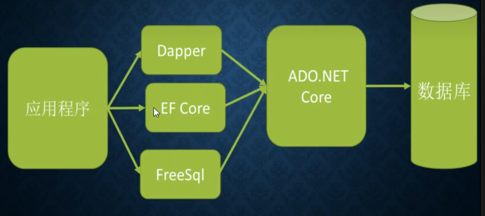

# 一.异步编程

“异步方法”：使用 `async` 关键字修饰的方法。

1. 异步方法的返回值一般都是 `Task<T>`，T 是真正的返回值类型，例如：`Task<int>`。

   > 惯例：异步方法命名以 Async 结尾。

2. 即使方法没有返回值，也最好将返回值声明为非泛型的 `Task`。

3. 调用异步方法时，也最好把返回值声明为非泛型的 `Task`。

4. 异步方法的”传染性“：一个方法中如果有 `await` 调用，则这个方法也必须修饰为 `async`。

## 1.调用异步方法

```c#
public async Task Write() {
    string fileName = @"D:\Programming\C#\C#Frame\DotNet Core\DotNet Core\1_Async\test_1.txt";
    await File.WriteAllTextAsync(fileName, "hello");
    string text = await File.ReadAllTextAsync(fileName);
    Console.WriteLine(text);
}
```

## 2.创建异步方法

```C#
public async Task<int> DownloadHtmlAsync(string url, string filename) {
    using var httpClient = new HttpClient();
    var html = await httpClient.GetStringAsync(url);
    await WriteAllTextAsync(filename, html);
    return html.Length;
}
```

如果同样的功能，既有同步方法，又有异步方法，那么首先使用异步方法。.NET5 中，许多框架中的方法也都是支持异步方法：Main()、WinForm 事件处理函数。

对于不支持异步的方法，可以使用 `File.WriteAllTextAsync(path, msg).Wait();` 或 `File.WriteAllTextAsync(path, msg).Result();`。

> `Wait()` （无返回值）和 `Result()` （有返回值）两个方法有死锁风险，尽量不要使用。

## 3.异步委托

```c#
public void Func() {
    ThreadPool.QueueUserWorkItem(async (obj) => {
        while (true) {
            await File.WriteAllTextAsync(@"D:\Programming\C#\C#Frame\DotNet Core\DotNet Core\1_Async\test_3.txt",
                                         "Hello");
            Console.WriteLine("hello");
        }
    });
    Console.Read();
}
```

## 4.Async和Awaite原理

```c#
static async Task Main(string[] args) {
    using (HttpClient httpClient = new HttpClient()) {
        string html = await httpClient.GetStringAsync("https://www.taobao.com");
        Console.WriteLine(html);
    }
    string destFilePath = "D:/1.txt";
    string content = "hello world";
    await File.WriteAllTextAsync(destFilePath, content);
    Console.WriteLine("写入成功");
    string msg = await File.ReadAllTextAsync(destFilePath);
    Console.WriteLine("文件内容: " + msg)
}
```

总结：`async` 修饰的方法会被 C# 编译器编译成一个类，会主要根据 `await` 调用进行切分，切分为多个状态，对 `async` 方法的调用会被拆分为对 `MoveNext()` 方法的调用。用 `await` 看似是“等待”，经过编译后，其实没有“等待”。

## 5.Async背后的线程切换

`await` 调用的等待期间，.NET 会把当前的线程返回给线程池，等异步方法调用执行完毕后，框架会从线程池再取出来一个线程执行后续的代码。

> `Thread.CurrentThread.ManagedThreadId` 获得当前线程 ID。

优化：到要等待的时候，如果发现已经执行结束了，就没有必要再切换线程，剩下的代码会继续在之前的线程上执行。

```c#
public async Task Func() {
    Console.WriteLine(Thread.CurrentThread.ManagedThreadId);

    var sb = new StringBuilder();
    for (int i = 0; i < 10000; i++) {
        sb.Append("hello world\n");
    }

    await File.WriteAllTextAsync("D:\\Programming\\C#\\C#Frame\\DotNet Core\\DotNet Core\\1_Async\\Temp\\test_3.txt",
                                 sb.ToString());

    Console.WriteLine(Thread.CurrentThread.ManagedThreadId);

}
```

注意：异步方法不代表多线程。异步方法的代码并不会自动在新线程中执行，除非手动将代码放入到新线程。

## 6.可以不用写Async关键字

`async` / `await` 关键字缺点：

1. 异步方法会生成一个类，运行效率没有普通方法高。
2. 可能会占用非常多的线程。

如果一个异步方法只是对别的异步方法调用的转发，并没有太多复杂的逻辑（比如等待 A 的结果，再调用 B；把 A 调用的返回值拿到内部做一些处理再返回），那么就可以不用写 `async` / `await` 关键字：

```c#
static Task<string> ReadAsync(int num) {
    switch(num) {
        case 1:
            return File.ReadAllTextAsync(@"d:\temp\test_1.txt");
        case 2:
            return File.ReadAllTextAsync(@"d:\temp\test_2.txt");
        default:
            throw new ArgumentException();
    }
}
```

不写 `async` / `await` 关键字优点：

1. 只甩手 `Task`，不“拆完了再装”。反编译后的代码，发现其只是普通的方法调用。
2. 运行效率更高，不会造成线程浪费。

## 7.不要使用Sleep

如果想要在异步方法中暂停一段时间，不要用 `Thread.Sleep()`，因为这会阻塞调用线程，而应该用 `await Task.Delay()`。

```c#
private async void button1_Click(object sender, EventArgs e) {
    using (HttpClient httpClient = new HttpClient()) {
        string s1 = await httpClient.GetStringAsync("https://www.youzack.com");
        textBox.Text = s1.Substring(0, 20);
        //Thread.Sleep(3000);
        await Task.Delay();
        string s2 = await httpClient.GetStringAsync("https://www.youzack.com");
       textBox.Text = s1.Substring(0, 100); 
    }
}
```

> 在控制台中看不到区别，但可以在 WinForm 程序中看到区别。ASP.Net Core 中也看不到区别，但是 `Sleep()` 会降低并发。

## 8.CancellationToken

有时需要提前终止任务，比如：请求超时、用户取消请求。很多异步方法都有 CancellationToken 参数，用于获得提前终止执行的信号。

常用方法：

- `None()` 空
- `bool IsCancellationRequested()` 是否取消
- `Register(Action callback)` 注册取消监听（不常用）
- `ThrowIfCancellationRequested()` 如果任务被取消，执行到这句话就会抛异常。
- `CancellationTokenSource()`
- `CancelAfter()` 超时后发出取消信号。
- `Cancel()` 发出取消信号

```c#
public async Task DownloadNoneAsync(string url, int n) {
    using var httpClien = new HttpClient();
    for (int i = 0; i < n; i++) {
        var html = await httpClien.GetStringAsync(url);
        Console.WriteLine($"{DateTime.Now}: {html}");
    }
}
public async Task DownloadAsync(string url, int n, CancellationToken cancellationToken) {
    using var httpClien = new HttpClient();
    for (int i = 0; i < n; i++) {
        var html = await httpClien.GetStringAsync(url);
        Console.WriteLine($"{DateTime.Now}: {html}");

        if (cancellationToken.IsCancellationRequested) {
            Console.WriteLine("下载被取消");
            break;
        }
    }
}
```

```c#
var cancellationToken = new CancellationToken_();

var tokenSource = new CancellationTokenSource();
tokenSource.CancelAfter(3000);

// await cancellationToken.DownloadNoneAsync("https://www.baidu.com", 10);
await cancellationToken.DownloadAsync("https://www.baidu.com", 100, tokenSource.Token);
```

> ASP.NET Core 开发中，一般不需要自己处理 `CancellationToken`、`CancellationTokenSource` 这些，只要做到**能转发 CancellationToken 就转发**即可。ASP.NET Core 会对用户中断请求进行处理。

## 9.WhenAll

Task 类的重要方法：

1. `Task<Task> WhenAny(IEnumerable<Task> tasks)` 等：任何一个 Task 完成，其他 Task 就都完成。
2. `Task<TResult[]> WhenAll<TResult>(params Task<TResult>[] tasks)` 等：所有 Task 完成，其他 Task 才完成。用于等待多个任务执行结束，不会在乎它们的执行顺序。
3. `FromResult()` 创建普通数值的 Task 对象。

```c#
public async Task Func() {
    var test1 = File.ReadAllTextAsync("D:\\Programming\\C#\\C#Frame\\DotNet Core\\DotNet Core\\1_Async\\Temp\\test_1.txt");
    var test2 = File.ReadAllTextAsync("D:\\Programming\\C#\\C#Frame\\DotNet Core\\DotNet Core\\1_Async\\Temp\\test_2.txt");
    var test3 = File.ReadAllTextAsync("D:\\Programming\\C#\\C#Frame\\DotNet Core\\DotNet Core\\1_Async\\Temp\\test_3.txt");

    var testArr = await Task.WhenAll(test1, test2, test3);
    for (int i = 0; i < testArr.Length; i++) {
        Console.WriteLine(testArr[i]);
    }
}
```

## 10.异步编程其他问题

**接口中的异步方法不能使用 `async`**：

`async` 是提示编译器为异步方法中的 `await` 代码进行分段处理的，而一个异步方法是否修饰了 async 对于方法的调用者来说没有区别，因此对于接口中的方法或者抽象方法不能修饰为 async。

**异步与 `yield`**：

`yield return` 不仅能够简化数据的返回，而且可以让数据处理”流水线化“，可以提升性能。

```c#
static IEnumerable<string> Test() {
    yield return "hello";
    yield return "yy";
    yield return "youzack";
}
```

> 在旧版 C# 中，async 方法中不能用 yield。从 C#8.0 开始，把返回值声明为 `IAsyncEnumerable` （不能带 Task），然后遍历的时候使用 `await foreach()` 即可。
>
> ```c#
> static async Task Main(string[] args) {
>     await foreach(var item in Test()) {
>         Console.WriteLine(item);
>     }
> }
> static async IAsyncEnumerable<string> Test() {
>     yield return "hello";
>     yield return "yy";
>     yield return "youzack";
> }
> ```

# 二.LINQ

LINQ 中提供了很多有关集合的扩展方法，配合 lambda 表达式可以简化数据处理。

```c#
public void Func() {
    int[] nums = { 10, 40, 3, 20, 1, 33, 60 };
    var nums2 = nums.Where(item => item > 10);
    foreach (var item in nums2) {
        Console.WriteLine(item);
    }
}
```

## 1.LINQ原理

```c#
public IEnumerable<int> MyWhere(IEnumerable<int> items, Func<int, bool> method) {
    var result = new List<int>();
    foreach (var item in items) {
        if (method(item)) {
            result.Add(item);
        }
    }

    return result;
}
public IEnumerable<int> MyWhere2(IEnumerable<int> items, Func<int, bool> method) {
    foreach (var item in items) {
        if (method(item)) {
            yield return item;
        }
    }
}
```

可以使用 `var` 让编译器的“类型推断”来简化类型的声明，在 LINQ 中常用。

> C# 的 var 和 JavaScript 的 var 不同。C# 中 var 是强类型的，C# 中的弱类型的是 daynamic。

## 2.常用LINQ方法

原始数据：

```c#
private List<Employee> _employees;

public CommonLinqFunc() {
    _employees = new List<Employee>();
    _employees.Add(new Employee(1, "tom", 12, true, 1000));
    _employees.Add(new Employee(2, "jerry", 14, true, 2000));
    _employees.Add(new Employee(3, "smith", 10, true, 100));
    _employees.Add(new Employee(4, "qq", 13, false, 3000));
    _employees.Add(new Employee(5, "hh", 11, false, 5000));
    _employees.Add(new Employee(6, "girl", 14, false, 8000));
    _employees.Add(new Employee(7, "boy", 12, true, 1000));
    _employees.Add(new Employee(8, "cute girl", 14, false, 10000));
}
```

**`Where()` 方法**：每一项数据都会经过 predicate 的测试，如果针对一个元素，predicate 执行的返回值为 true，那么这个元素就会放到返回值中。

`Where()` 参数是一个 lambda 表达式格式的匿名方法，方法的参数 item 表示当前判断的元素对象。

```c#
public void UseWhere() {
    var result = _employees.Where(item => item.Age > 10);
    foreach (var item in result) {
        Console.WriteLine(item);
    }
}
```

**`Count()` 方法**：获取数据条数。

```c#
public void UseCount() {
    Console.WriteLine(_employees.Count());
    Console.WriteLine(_employees.Count(item => item.Salary > 5000));
}
```

**`Any()` 方法**：是否至少有一条数据满足条件。

有可能比 `Count()` 实现效率高。

```c#
public void UseAny() {
    Console.WriteLine(_employees.Any());
    Console.WriteLine(_employees.Any(item => item.Salary == 5000));
}
```

**获取一条数据（是否带参的两种写法）**：

- `Single()`：有且只有一条满足要求的数据。
- `SingleOrDefault()`：最多只有一条满足要求的数据。
- `First()`：至少有一条，返回第一条。
- `FirstOrDefault()`：返回第一条或者默认值。

```c#
public void UseSingle() {
    var result = _employees.Single(item => item.Name == "tom");
    Console.WriteLine(result);

    result = _employees.SingleOrDefault(item => item.Name == "xxx");
    Console.WriteLine(result);

    result = _employees.First(item => item.Age > 12);
    Console.WriteLine(result);

    result = _employees.FirstOrDefault(item => item.Age > 32);
    Console.WriteLine(result);
}
```

**排序**：

- `Order()`：对数据正序排序。
- `OrderByDescending()`：倒序排序。

对于简单类型排序，也许可以不用 lambda 表达式。特殊案例：按照最后一个字符排序，用 Guid 或者随机数进行随机排序。

```c#
public void UseOrder() {
    var result1 = _employees.Where(item => item.Salary > 4000);

    result1 = result1.OrderBy(item => item.Age);
    foreach (var item in result1) {
        Console.WriteLine(item);
    }

    var result2 = _employees.OrderByDescending(item => item.Salary);
    Console.WriteLine("=================");
    foreach (var item in result2) {
        Console.WriteLine(item);
    }

    var result3 = _employees.OrderBy(item => Guid.NewGuid());
    Console.WriteLine("=================");
    foreach (var item in result3) {
        Console.WriteLine(item);
    }
}
```

**多规则排序**：

可以在 `Order()`、`OrderByDescending()` 后继续写 `ThenBy()`、`ThenByDescending()`。

案例：优先按照 Age 排序，如果 Age 相同再按照 Salary 排序。

```c#
var result4 = _employees.OrderBy(item => item.Age > 10).ThenBy(item => item.Salary < 1000);

```

**限制结果集，获取部分数据**：

`Skip(n)` 跳过 n 条数据，`Take(n)` 获取 n 条数据。

案例：获取从第 2 条开始的 3 条数据。

> `Skip()`、`Take()` 也可以单独使用。

```c#
public void UseSkipAndTake() {
    var result = _employees.Skip(2).Take(3);
    foreach (var item in result) {
        Console.WriteLine(item);
    }
}
```

**聚合函数**：

- `Max()`
- `Min()`
- `Average()`
- `Sum()`
- `Count()`

LINQ 中所有的扩展方法几乎都是针对 IEnumerable 接口的，而几乎所有能返回集合的都返回 IEnumerable，所以几乎所有方法都可以“链式使用”。

```c#
list.Where(item => item.Age > 30).Min(item => item.Salary);
```

**投影**：

`select()` 方法：将集合中的每一项转换为另一种类型。

```c#
public void UseSelect() {
    var ageList = _employees.Select(item => item.Age);
    foreach (var age in ageList) {
        Console.Write(age + " ");
    }
}
```

**集合转换**：

有一些地方需要数组类型或者 List 类型的变量，可以用 `ToArray()` 方法和 `ToList()` 分别把 `IEnumberable<T>` 转换成数组类型和 `List<T>` 类型。

```c#
public void UseToListAndToArray() {
    var salarys = _employees.Where(item => item.Salary > 4000)
        .Select(item => item.Salary);
    var list = salarys.ToList();
    foreach (var item in list) {
        Console.WriteLine(item);
    }

    Console.WriteLine("=========");

    var array = salarys.ToArray();
    foreach (var item in array) {
        Console.WriteLine(item);
    }
}
```

## 3.LINQ查询语法

使用 `Where()`、`OrderBy()`、`Select()` 等扩展方法进行数据查询的写法叫做“LINQ方法语法”，还有一种查询语法的写法。

```c#
public void QueryGrammar() {
    var result = _employees.Where(e => e.Salary > 4000)
        .OrderBy(e => e.Age)
        .Select(e => new { e.Name, e.Age, Gender = e.Gender ? "男" : "女" });
    foreach (var item in result) {
        Console.WriteLine(item);
    }

    Console.WriteLine("===========================");

    var result2 = from e in _employees
        where e.Salary > 4000
        select new { e.Name, e.Age, Gender = e.Gender ? "男" : "女" };
    foreach (var item in result2) {
        Console.WriteLine(item);
    }
}
```

> 区别：
>
> 运行时没有区别，编译后都是一样的。
>
> “查询语法”看起来更酷，但是“方法语法”更实用，因此 .NET 开发者大部分还是用“方法语法”。

# 三.依赖注入

生活中的“控制反转”：自己发电和用电网的电。

依赖注入（Dependency Injection，DI）是控制反转（Inversion of Control，IOC）思想的实现方式。

依赖注入简化模块的组装过程，降低模块之间的耦合度。

## 1.DotNet中DI服务注册

DI 中的概念：

- 服务（service）：对象。
- 注册服务：注册了的服务。
- 服务容器：负责管理注册的服务。
- 查询服务：创建对象及关联对象。
- 对象生命周期：Transient（瞬态）、Scoped（范围）、Singleton（单例）。

如何在 .Net 中使用 DI：

1. 根据类型来获取和注册服务。

   可以分别指定服务类型（service type）和实现类型（implementation type），这两者可能相同，也可能不同。服务类型可以是类，也可以是接口。建议面向接口编程，更灵活。

2. .NET 控制反转组件取名为 `DependencyInjection`，但它包含 `ServiceLocator` 的功能。

## 2.在DotNet中使用DI

1. 安装 DependencyInjection `Install-Package Microsoft.Extensions.DependencyInjection`
2. 使用 DependencyInjection `using Microsoft.Extensions.DependencyInjection;`
3. 代码：

```c#
public void Use() {
    var service = new ServiceCollection();
    service.AddTransient<TestServiceImpl>();

    using var sp = service.BuildServiceProvider();
    var testServiceImpl = sp.GetService<TestServiceImpl>();

    if (testServiceImpl != null) {
        testServiceImpl.Name = "tom";
        testServiceImpl.SayHi();
    }
}
```

## 3.服务的生命周期

1. 在类构造函数中打印，可以查看不同生命周期的对象创建。使用 `serviceProvider,CreateScope()` 创建 Scope。
2. 如果一个类实现了 `IDisposable()` 接口，在离开作用域之后容器会自动调用对象的 `Dispose()` 方法。
3. 不要在长生命周期的对象中引用比它短的生命周期的对象。在 ASP.NET Core 中，这样做默认会抛出异常。
4. 生命周期的选择：如果类无状态，建议为 Singleton；如果类有状态，且为 Scope 控制，建议为 Scoped，因为通常这种 Scope 控制下的代码都是运行在同一个线程中的，没有并发修改的问题；在使用 Transient 时要谨慎。

## 4.服务定位器

- `T GetService<T>()` 如果获取不到对象，则返回 null。
- `object getService(Type serviceType)`
- `T GetRequiredService<T>()` 如果获取不到对象，则抛异常。
- `object GetRequiredService(Type serviceType)`
- `IEnumerable<T> GetServices<T>()` 适用于可能有很多满足条件的服务的情况。
- `IEnumerable<object> GetServices(Type serviceType)`

## 5.依赖注入传染性

1. 依赖注入是有“传染性”的，如果一个类的对象是通过 DI 创建的，那么这个类的构造函数中声明的所有服务类型的参数都会被 DI 赋值；但是如果一个对象是程序员手动创建的，那么这个对象就和 DI 没有关系，它的构造函数中声明的服务类型参数就不会被自动赋值。
2. .NET 的 DI 默认是构造函数注入。

```c#
public class InfectDi {
    public void Use() {
        var server = new ServiceCollection();
        server.AddScoped<Controller>();
        server.AddScoped<ILog, LogImpl>();
        // server.AddScoped<IConfig, ConfigImpl>();
        server.AddScoped<IConfig, DbConfigImpl>();
        server.AddScoped<IStorage, StorageImpl>();

        using var provider = server.BuildServiceProvider();
        var rs = provider.GetRequiredService<Controller>();
        rs.Test();
    }
    
    
    class Controller {
        private readonly ILog _log;
        private readonly IStorage _storage;

        public Controller(ILog log, IStorage storage) {
            this._log = log;
            this._storage = storage;
        }

        public void Test() {
            _log.Log("开始上传");
            _storage.Save("abcdefg", "word.txt");
            _log.Log("上传结束");
        }

    }

    interface ILog {
        public void Log(string msg);
    }

    class LogImpl : ILog {
        public void Log(string msg) {
            Console.WriteLine($"日志: {msg}");
        }
    }

    interface IConfig {
        public string GetValue(string name);
    }

    // class ConfigImpl: IConfig {
    //     public string GetValue(string name) {
    //         return "hello";
    //     }
    // }

    class DbConfigImpl: IConfig {
        public string GetValue(string name) {
            Console.WriteLine("从数据库读取配置");
            return "hello db";
        }
    }

    interface IStorage {
        public void Save(string content, string name);
    }

    class StorageImpl: IStorage {
        private readonly IConfig _config;

        public StorageImpl(IConfig config) {
            this._config = config;
        }
        
        public void Save(string content, string name) {
            var server = _config.GetValue("server");
            Console.WriteLine($"向服务器 {server} 中名字为 {name} 的文件上传内容 {content}");
        }
    }
}
```

## 6.综合案例一

**需求说明**：

1. 目的：演示 DI 的能力。
2. 有配置服务、日志服务，然后再开发一个邮件发送器服务。可以通过配置服务来从文件、环境变量、数据库等地方读取配置，可以通过日志服务来将程序运行过程中的日志信息写入文件、控制台、数据库等。

```c#
//略……
```

## 7.综合案例二

优化一：从配置文件中读取信息

`IniFileConfigService.cs`

```c#
public class IniFileConfigService : IConfigService {
    public string FilePath { get; set; }

    public string? GetValue(string name) {
        var kv = File.ReadAllLines(FilePath)
            .Select(ite => ite.Split('='))
            .Select(strs => new { Name = strs[0], Value = strs[1] })
            .SingleOrDefault(kv => kv.Name == name);

        return kv?.Value;
    }
}
```

`ExampleMain.cs`

```c#
service.AddScoped(typeof(IConfigService), it => new IniFileConfigService {FilePath = "D:\\Programming\\C#\\C#Frame\\DotNet Core\\DotNet Core\\3_DI\\Example1\\mail.ini"});
```

优化二：使用扩展方法

`IniFileConfigExtensions.cs`

```c#
public static class IniFileConfigExtensions {
    public static void AddIniFileConfig(this IServiceCollection services, string filePath) {
        services.AddScoped(typeof(IConfigService),
            s => new IniFileConfigService { FilePath = filePath });
    }
}
```

`ConsoleLogExtensions.cs`

```c#
public static class ConsoleLogExtensions {
    public static void AddConsoleLog(this IServiceCollection services) {
        services.AddScoped<ILogProvider, ConsoleLogProvider>();
    }
}
```

`ExampleMain.cs`

```c#
service.AddIniFileConfig("D:\\Programming\\C#\\C#Frame\\DotNet Core\\DotNet Core\\3_DI\\Example1\\mail.ini");        
service.AddConsoleLog();
```

## 8.综合案例三

1. “可覆盖的配置读取器”。配置中心服务器。可以本地的覆盖配置服务器的，或者配置文件覆盖环境变量的。例如，按照“配置中心服务器”、“本地环境变量”、“本地配置文件”的顺序添加了三个配置提供者，在“配置中心服务器”中提供了 “a=1; b=2; c=3” 这三个配置项，在“本地环境变量”中配置了 "a=10; b=20"，在“本地配置文件”中配置了 "b=200"，那么最终读取的时候读到的就是 "a=10; b=200; c=3"。
2. 定义一个从各个 `ConfigProvide` 中读取项的 `IConfigReader` 接口，编写实现类 `LayeredConfigReader`。

`IConfigReader.cs`

```c#
public interface IConfigReader {
    public string? GetValue(string name);
}
```

`LayeredConfigReader.cs`

```c#
public class LayeredConfigReader: IConfigReader {
    private readonly IEnumerable<IConfigService> _services;

    public LayeredConfigReader(IEnumerable<IConfigService> services) {
        this._services = services;
    }
    
    public string? GetValue(string name) {
        string? value = null;

        foreach (var service in _services) {
            var newValue = service.GetValue(name);
            if (newValue != null) {
                value = newValue;
            }
        }

        return value;
    }
}
```

# 四.配置系统

传统 Web.config 配置具有很多缺点，在 .NET Core 时代为了兼容，仍然可以使用 Web.config 配置文件和 `ConfigurationManager` 配置类，但是不推荐。

.NET 中的配置系统支持丰富的配置源，包括文件（json、xml、ini 等）、注册表、环境变量、命令行、Azure Key Vault 等，还可以配置自定义配置源。并且可以跟踪配置的改变，可以按照优先级进行覆盖。 

## 1.Json文件读取配置

1. 创建一个 json 文件，文件名随意，比如 config.json，设置“如果较新则复制”。

2. NuGet 安装 `Microsoft.Extensions.Configuration` 和 `Microsoft.Extensions`

   `.Configuration.Json`。

3. 编写代码，先用简单的方式读取配置。

```c#
public void Use() {
    var builder = new ConfigurationBuilder();
    builder.AddJsonFile("D:\\Programming\\C#\\C#Frame\\DotNet Core\\DotNet Core\\4_Configuration\\config.json", optional: true, reloadOnChange: true);
    var configRoot = builder.Build();

    var name = configRoot["name"];
    var address = configRoot.GetSection("proxy")["address"];

    Console.WriteLine($"name = {name}");
    Console.WriteLine($"address = {address}");
}
```

**绑定读取配置：**

1. 可以绑定一个类，自动完成配置的读取。
2. NuGet 安装：`Microsoft.Extensions.Configuration.Binder`
3. `Server server = configRoot.GetSection("proxy").Get<Server>()`

```c#
var config = configRoot.Get<Config>();
Console.WriteLine(config?.Name);
Console.WriteLine(config?.Proxy.Port);
```

## 2.选项方式读取配置

更推荐使用选项方式读取配置信息，和 DI 结合更好，而且可以更好的利用 `reloadonchange` 机制。

使用：

1. NuGet 安装：
   - `Microsoft.Extensions.Options`
   - `Microsoft.Extensions.Configuration.Binder`
   - `Microsoft.Extensions.Configuration`
   - `Microsoft.Extensions.Configuration.Json`
2. 读取配置的时候，DI 要声明 `IOptions<T>`、`IOptionsMonitor<T>`、`IOptionsSnapshot<T>` 等类型。`IOptions<T>` 不会读取到新的值，和 `IOptionsMonitor<T>` 相比，`IOptionsSnapshot<T>`  会在同一个范围内（比如 ASP.NET Core 的一个请求中）保持一致。建议使用 `IOptionsSnapshot<T>` 。

**代码演示：**

在读取配置的地方，使用 `IOptionsSnapshot<T>` 注入，不要再构造函数里直接读取 `IOptionsSnapshot.Value`，而是要到用到的地方再读取，否则就无法更新变化。

`OptionsController.cs`：

```c#
public class OptionsController {
    private readonly IOptionsSnapshot<Config> _optConfig;

    public OptionsController(IOptionsSnapshot<Config> optConfig) {
        _optConfig = optConfig;
    }

    public void Test() {
        Console.WriteLine("name = " + _optConfig.Value.Name);
        Console.WriteLine("age = " + _optConfig.Value.Age);
    }
}
```

`OptionsRead.cs`：

```c#
public class OptionsRead {
    public void Use() {
        ServiceCollection services = new ServiceCollection();
        services.AddScoped<OptionsController>();
        
        ConfigurationBuilder configBuilder = new ConfigurationBuilder();
        configBuilder.AddJsonFile("D:\\Programming\\C#\\C#Frame\\DotNet Core\\DotNet Core\\4_Configuration\\config.json", optional: true, reloadOnChange: true);
        IConfigurationRoot configRoot = configBuilder.Build();

        services.AddOptions().Configure<Config>(e => configRoot.Bind(e));
        using var sp = services.BuildServiceProvider();
        var controller = sp.GetRequiredService<OptionsController>();
        controller.Test();
    }
}
```

## 3.命令行方式配置

配置框架还支持从命令行参数、环境变量等地方读取。

NuGet 安装：`Microsoft.Extensions.Configuration.CommandLine`

参数支持多种格式，比如：`server=127.0.0.1`、`--server=127.0.0.1`、`--server 127.0.0.1`、`/server=127.0.0.1`、`/server 127.0.0.1`

> 注意在键值之间加空格，格式不能混用。

```c#
public void Use(string[] args) {
    ServiceCollection services = new ServiceCollection();
    services.AddScoped<OptionsController>();

    ConfigurationBuilder configBuilder = new ConfigurationBuilder();
    configBuilder.AddCommandLine(args);
    IConfigurationRoot configRoot = configBuilder.Build();

    services.AddOptions().Configure<Config>(e => configRoot.Bind(e));
    using var sp = services.BuildServiceProvider();
    var controller = sp.GetRequiredService<OptionsController>();
    controller.Test();
}
```

**扁平化配置：**

对于环境变量、命令行等简单的键值对结构，如果想要进行复杂结构的配置，需要进行“扁平化处理”“。对于配置的名字需要采用”层级配置“。例如：`a:b:c`，对于数字这样配置：`a:b:c:0`、`a:b:c:1`。

## 4.环境变量配置

1. NuGet 安装：`Microsoft.Extensions.Configuration.EnvironmentVariables`。

2. `configurationBuilder.AddEnvironmentVariables()`。

   `AddEnvironmentVariables()` 有无参数和有 prefix 参数的两个重载版本。无参数版本会把程序相关的所有环境变量都加载进来，由于有可能和系统中已有的环境变量冲突，因此建议用有 prefix 参数的 `AddEnvironmentVariables()`。读取配置的时候，prefix 参数会被忽略。

3. 在 VS 中调试时，为了避免修改系统环境变量，可以直接在 VS 中设置变量的方法。

## 5.开发自定义配置

**开发自定义配置提供者的步骤：**

1. 开发一个直接或者间接实现 `IConfigurationProvider` 接口的类，一般继承自 `ConfigurationProvider`（如果是从文件中读取，可以继承自 `FileConfigurationProvider`），然后重写 Load 方法，将”扁平化数据“设置到 Data 属性即可。
2. 再开发一个实现了 `IConfigurationSource` 接口的类（如果是从文件中读取，可以继承自 `FileConfigurationSource`），然后在 Build 方法中返回上面的 `ConfigurationProvider` 对象。
3. 最后使用即可：`configurationBuilder.Add(new ConfigurationSource())`，为了简化使用，一般提供一个扩展方法 `IConfigurationBuilder`。

整体流程：编写 `ConfigurationProvider` 类实际读取配置；编写 `ConfigurationSource` 在 Build 中返回 `ConfigurationProvider` 对象；把 `ConfigurationSource` 对象加入到 `IConfigurationBuidler`。

`CustomConfigProvider.cs`

```c#
public class CustomConfigProvider : FileConfigurationProvider {
    public CustomConfigProvider(FileConfigurationSource source) : base(source) {
    }
    public override void Load(Stream stream) {
        //声明一个字典，存放映射结果，并忽略大小写
        var resultData = new Dictionary<string, string>(StringComparer.OrdinalIgnoreCase);
        //获取配置文件中的节点
        var xmlDocument = new XmlDocument();
        xmlDocument.Load(stream);
       
        //获取节点 connectionStrings
        var connStrNodeList = xmlDocument.SelectNodes("/configuration/connectionStrings/add");
        //遍历节点数组，提取指定的值
        foreach (var xmlNode in connStrNodeList.Cast<XmlNode>()) {
            var name = xmlNode.Attributes["name"]?.Value;
            var connectionString = xmlNode.Attributes["connectionString"]?.Value;
            var providerName = xmlNode.Attributes["providerName"];

            //[conn1:{connectionString:"ashdss",providerName="def"},
            //conn2:{connectionString:"ervs",providerName="vdfcv"}]
            if (connectionString != null) resultData[$"{name}:connectionString"] = connectionString;
            if (providerName != null) resultData[$"{name}:providerName"] = providerName.Value;
        }
        
        //获取节点 appSettings
        var appSeNodeList = xmlDocument.SelectNodes("/configuration/connectionStrings/add");
        //遍历节点数组，提取指定的值
        foreach (var xmlNode in appSeNodeList.Cast<XmlNode>()) {
            var key = xmlNode.Attributes["key"].Value;
            key = key.Replace('.', ':');
            var value = xmlNode.Attributes["value"].Value;
            //扁平化映射
            resultData[key] = value;
        }
        this.Data = resultData!;
    }
}
```

`CustomConfigSource.cs`

```c#
public class CustomConfigSource: FileConfigurationSource {
    public override IConfigurationProvider Build(IConfigurationBuilder builder) {
        EnsureDefaults(builder);    //处理 path 路径默认值问题
        return new CustomConfigProvider(this);
    }
}
```

# 五.日志系统

## 1.基本概念

1. 日志级别：**Trance < Debug < Information < Warning < Error < Critical**
2. 日志提供者（LoggingProvider）：将日志输出到哪里，控制台、文件、数据库等。
3. .NET 的日志非常灵活，对于业务代码只要注入日志对象记录日志即可，具体哪些日志输出到哪里，什么样的格式，是否输出等都有配置或者初始化代码决定。

## 2.输出到控制台

NuGet：`Microsoft.Extensions.Logging`、`Microsoft.Extensions.Logging.Console`。

DI 注入：

```c#
services.AddLogging(logBuilder => {
    logBuilder.AddConsole();	//可以注入多个 Provider
});
```

需要记录日志的代码，注入 `ILogger<T>` 即可，`T` 一般使用当前类，这个类的名字会输出到日志，方便定位错误，然后调用 `LogInformation()`、`LogError()` 等方法输出不同级别的日志，还支持输出异常对象。

```c#
public class UseLogging {
    public void Use() {
        var serviceCollection = new ServiceCollection();
        serviceCollection.AddLogging(loggingBuilder => {
            loggingBuilder.AddConsole();
            loggingBuilder.SetMinimumLevel(LogLevel.Trace);
        });
        serviceCollection.AddScoped<LoggingTest>();

        using var provider = serviceCollection.BuildServiceProvider();
        var loggingTest = provider.GetRequiredService<LoggingTest>();
        loggingTest.Test();
    }
}
public class LoggingTest {
    private readonly ILogger<LoggingTest> _logger;

    public LoggingTest(ILogger<LoggingTest> logger) {
        _logger = logger;
    }

    public void Test() {
        _logger.LogDebug("开始执行数据库同步");
        _logger.LogDebug("连接数据库成功");
        _logger.LogWarning("查找数据库失败，重试第一次");
        _logger.LogWarning("查找数据库失败，重试第二次");
        _logger.LogError("查找数据库最终失败");

        //还可以记录异常消息
        try {
            File.ReadAllText("A://Text.txt");
            _logger.LogDebug("读取文件成功");
        } catch (Exception e) {
            _logger.LogError(e, "读取文件失败");
        }
    }
}
```

## 2.其他日志提供者

1. Console 只适合开发阶段，在运行阶段需要将日志信息输出到文件中、
2. 采用和 `Configuration` 类似的扩展机制，不仅内置了 Debuf、事件查看器、文件、Azure日志等提供者，还可以扩展，`Provider` 还可以共存。
3. EventLog：Windows 下的日志存储器，在 Windows 下部署的程序，如果网站运行出错、不正常，都会存放在 EventLog （只能 Windows 使用）。
4. NuGet 安装：
   - `Microsoft.Extensions.Logging.EventLog`
   - 然后使用 EventLog：`logBuilder.AddEventLog()`

```c#
public class UseLogging {
    public void Use() {
        var serviceCollection = new ServiceCollection();
        serviceCollection.AddLogging(loggingBuilder => {
            loggingBuilder.AddConsole();
            logBuilder.AddEventLog();
            loggingBuilder.SetMinimumLevel(LogLevel.Trace);
        });
        serviceCollection.AddScoped<LoggingTest>();

        using var provider = serviceCollection.BuildServiceProvider();
        var loggingTest = provider.GetRequiredService<LoggingTest>();
        loggingTest.Test();
    }
}
```

## 3.文本日志

**问题：**

1. 文本日志一般按照日期区分。
2. 为避免文本日志将磁盘撑爆，可以限制日志总个数或者总大小。
3. 如果单个日志文件太大，需要限制单个文件的大小。

**NLOG：**

1. NET没有内置的文本日志提供者，但是第三方有 Log4Net、NLog、Serilog 等。因为老牌的 Log4Net 是一套独立的日志系统，所以不考虑使用。
2. NLog 安装：`NLog.Extensions.Logging`。
3. 在项目根目录下创建 `nlog.config` 文件。注意文件名的大小写，也可以是其他文件名，但是需要单独配置（约定大于配置）。
4. 添加代码：`logBuilder.AddNLog()`

`nlog.config`

```
<?xml version="1.0" encoding="utf-8" ?>
<nlog xmlns="http://www.nlog-project.org/schemas/NLog.xsd"
      xmlns:xsi="http://www.w3.org/2001/XMLSchema-instance"
      autoReload="true"
      internalLogLevel="Info"
      internalLogFile="D:\Programming\C#\C#Frame\DotNet Core\DotNet Core\5_Logging\log\internal-nlog-AspNetCore.txt">

    <!-- enable asp.net core layout renderers -->
    <extensions>
        <add assembly="NLog.Web.AspNetCore"/>
    </extensions>

    <!-- the targets to write to -->
    <targets>
        <!-- File Target for all log messages with basic details -->
        <target xsi:type="File" name="allfile" fileName="D:\Programming\C#\C#Frame\DotNet Core\DotNet Core\5_Logging\log\nlog-AspNetCore-all-${shortdate}.log"
                layout="${longdate}|${event-properties:item=EventId:whenEmpty=0}|${level:uppercase=true}|${logger}|${message} ${exception:format=tostring}" />

        <!-- File Target for own log messages with extra web details using some ASP.NET core renderers -->
        <target xsi:type="File" name="ownFile-web" fileName="D:\Programming\C#\C#Frame\DotNet Core\DotNet Core\5_Logging\log\nlog-AspNetCore-own-${shortdate}.log"
                layout="${longdate}|${event-properties:item=EventId:whenEmpty=0}|${level:uppercase=true}|${logger}|${message} ${exception:format=tostring}|url: ${aspnet-request-url}|action: ${aspnet-mvc-action}" />

        <!--Console Target for hosting lifetime messages to improve Docker / Visual Studio startup detection -->
        <target xsi:type="Console" name="lifetimeConsole" layout="${MicrosoftConsoleLayout}" />
    </targets>

    <!-- rules to map from logger name to target -->
    <rules>
        <!--All logs, including from Microsoft-->
        <logger name="*" minlevel="Trace" writeTo="allfile" />

        <!--Output hosting lifetime messages to console target for faster startup detection -->
        <logger name="Microsoft.Hosting.Lifetime" minlevel="Info" writeTo="lifetimeConsole, ownFile-web" final="true" />

        <!--Skip non-critical Microsoft logs and so log only own logs (BlackHole) -->
        <logger name="Microsoft.*" maxlevel="Info" final="true" />
        <logger name="System.Net.Http.*" maxlevel="Info" final="true" />

        <logger name="*" minlevel="Trace" writeTo="ownFile-web" />
    </rules>
</nlog>
```

`TextLogging.cs`

```c#
public class TextLogging {
    public void Use() {
        var serviceCollection = new ServiceCollection();
        serviceCollection.AddLogging(loggingBuilder => {
            loggingBuilder.AddConsole();
            //设置显示出来的日志级别
            loggingBuilder.SetMinimumLevel(LogLevel.Trace);
            //添加日志信息到文本文件里面
            loggingBuilder.AddNLog();
        });
        serviceCollection.AddScoped<LoggingTest>();

        using var provider = serviceCollection.BuildServiceProvider();
        var loggingTest = provider.GetRequiredService<LoggingTest>();
        loggingTest.Test();
    }
}
```

## 4.日志分类和过滤

**日志过滤和分类原因：**

1. 为什么要有日志分类？不同级别或者不同模块的日志需要记录到不同的地方。
2. 为什么要日志过来？项目不同阶段（比如刚上线和稳定后）需要记录的日志不同。严重错误日志可以调用短信 Provider。

**`nlog.config` 参数解析：**

1. `archiveAboveSize`：单个日志文件超过指定字节就将日志存档，单位是字节。这个参数可以避免单个文件太大，如果不设置 `maxArchiveFiles` 参数，则文件日志存档的文件数量就会一直增加；而如果设定了`maxArchiveFiles` 参数后，则最多保存 `maxArchiveFiles` 指定数量个数的存档文件，旧的就会被删除。
2. `maxArchiveDays` ：可以设定日志文件的保存天数。 

**rules**：

1. rules 节点下可以添加多个 logger，每个 logger 都有指定的名字（`name` 属性）。name 是通配符格式。
2. logger 节点的 `minlevel` 属性和 `maxlevel` 属性，表示这个 logger 接受的日志最低级别和最高级别。
3. 日志输出时，会从上往下匹配 rules 节点下所有的 logger，若发现当前日志的分类名符合这个 logger 的 `name` 的通配符，就会将日志输出给此 logger。如果匹配多个 logger，就会将这条日志输出给多个 logger。但是如果一个 logger 设置属性 `final="true"`，则如果匹配到这个 logger，就不会继续向下匹配其他 logger。

**NLog 其他：**

1. NLog 的部分功能和 .NET 的 Logging 重复，比如分类、分级、各种 Provider。
2. 为避免冲突，如果用 NLog，建议不要再配置 .Net 的分级等。

## 5.结构化日志和集中化日志

**结构化日志：**

结构化日志比普通文本更有利于日志的分析，比如统计“邮件发送失败”、“错误发生了多少次”。

**集中化日志：**

集群化部署环境中，有 N 多服务器，如果每个服务器都把日志记录到本地文件，不便于查询、分析。此时就需要把日志保存到集中化的日志服务器中。

**Serilog：**

NLog 也可以配置结构化日志，不过配置麻烦，推荐使用 Serilog。

1. NuGet 安装：`Serilog.AspNetCore`

2. 使用：

   ```c#
   Log.Logger = new LoggerConfiguration()
       .MinimumLevel.Debug()
       .Enrich.FromLogContext()
       .WriteTo.Console(new JsonFormatter())
       .CreateLogger();
   loggingBuilder.AddSerilog();
   ```

3. 要记录的结构化数据通过占位符输出：

   ```c#
   logger.LogWarning("新增用户{@person}", new {Id=3, Name="zack"});
   ```

4. 同样可以输出到文件、数据库、MongoDB 等。

```c#
public class Serilog {
    public void Use() {
        var serviceCollection = new ServiceCollection();
        serviceCollection.AddLogging(loggingBuilder => {
            //配置 serilog 信息
            Log.Logger = new LoggerConfiguration()
                .MinimumLevel.Debug()
                .Enrich.FromLogContext()
                .WriteTo.Console(new JsonFormatter())
                .CreateLogger();
            loggingBuilder.AddSerilog();
        });
        serviceCollection.AddScoped<LoggingTest>();

        using var provider = serviceCollection.BuildServiceProvider();
        var loggingTest = provider.GetRequiredService<LoggingTest>();
        loggingTest.Test();
    }
}
```

## 6.总结

1. 普通项目用 NLog 输出到文本文件即可，根据需要设定过滤、分类规则。
2. 集群部署的项目用 Serilog + “集中式日志服务”。如果需要记录结构化日志，再进行结构化输出。
3. 如果用云服务就够了的，就用云服务的，避免自己部署；如果想要自己控制日志数据就用自部署 Exceptionless 或 ELK（难度较大）等。

# 六.EF Core

## 1.什么是 ORM

1. ORM：Object Relational Mapping。让开发者用对象操作的形式操作关系数据库。

   1. 比如插入：

      ```c#
      User user = new User() {Name="admin", Password="123"};
      orm.Save(user);
      ```

   2. 比如查询：

      ```c#
      Book b = orm.Books.Single(b => b.Id == 3 || b.Name.Contains(".NET"));
      string bookName = b.Name;
      string aName = a.Author.Name;
      ```

2. 有哪些 ORM：EF Core、Dapper、SqlSugar、FreeSql 等。

**EF Core 与其他 ORM 比较：**

1. Entity Framework Core（EF Core）是微软官方的 ORM 框架，优点是：功能强大、官方支持、生产效率高、力求屏蔽底层数据库差异；缺点：复杂、上手门槛高、不熟悉 EF Core 的话容易进坑。
2. Dapper 的优点：简单，N 分钟即可上手，行为可预期性强；缺点：生产效率低，需要处理底层数据库差异。
3. EF Core 是模型驱动（Model-Driven）的开发思想，Dapper 是数据库驱动（DataBase-Driven）的开发思想。两者没有优劣，只有比较。
4. 性能：Dapper 等 ≠ 性能高；EF Core ≠ 性能差。
5. EF Core 是官方推荐、推进的框架，尽量屏蔽底层数据库差异，.NET 开发者必须熟悉，根据项目情况决定用哪个。

## 2.搭建EFCore开发环境

**用什么数据库？**

1. EF Core 是对于底层 ADO.NET Core 的封装，因此 ADO.NET Core 支持的数据库不一定被 EF Core 支持。
2. EF Core 支持所有主流的数据库，包括 MS SQL Server、Oracle、MySQL、PostgreSQL、SQLite等。可以自己实现 Provider 去支持其他数据库。
3. 对于 SQLServer 支持最完美，MySQL、PostgreSQL 也不错（可能有能解决的小坑）。这三者是 .NET 圈内用的最多的三个。

**开发环境搭建：**

1. 建实体类。

   ```c#
   public class Book {
       public long Id { get; set; } //主键
       public string Title { get; set; } //标题
       public DateTime PubTime { get; set; } //发布日期
       public double Price { get; set; } //单价
   }
   
   public class Person {
       public long Id { get; set; }
       public string Name { get; set; }
       public int Age { get; set; }
   }
   ```

2. NuGet安装：`Microsoft.EntityFrameworkCore.SqlServer`。

3. 建立配置类：创建实现了 `IEntityTypeConfiguration` 接口的实体配置类，配置实体类和数据库表的对应关系。

   ```c#
   public class BookConfig: IEntityTypeConfiguration<Book> {
       public void Configure(EntityTypeBuilder<Book> builder) {
           //配置表名
           builder.ToTable("db_book");
           //设置约束条件：字段长度为 20，不能为空
           builder.Property(book => book.Title)
               .HasMaxLength(20)
               .IsRequired();
           builder.Property(book => book.Author)
               .HasMaxLength(20)
               .IsRequired();
       }
   }
   
   public class PersonConfig: IEntityTypeConfiguration<Person> {
       public void Configure(EntityTypeBuilder<Person> builder) {
           //配置表名
           builder.ToTable("db_persons");
       }
   }
   ```

4. 建立DbContext，生成数据库。

   ```c#
   public class MySqlDbContext : DbContext {
       public DbSet<Book> Books { set; get; }
       public DbSet<Person> Persons { set; get; }
   
       protected override void OnConfiguring(DbContextOptionsBuilder optionsBuilder) {
           //配置数据库连接字符串
           optionsBuilder.UseMySql(
               "Server=localhost;Port=3306;Database=ef_core;Uid=root;Pwd=123abc;",
               ServerVersion.Parse("8.0.32-mysql")
           );
       }
   
       protected override void OnModelCreating(ModelBuilder modelBuilder) {
           base.OnModelCreating(modelBuilder);
           //从当前程序集加载所有 IEntityTypeConfiguration 配置类
           modelBuilder.ApplyConfigurationsFromAssembly(GetType().Assembly);
       }
   }
   ```

5. 编写调用 EF Core 的业务代码。

**Migration 数据库迁移：**

面向对象的 ORM 开发中，数据库不是程序员手动创建的，而是由 Migration 工具生成。关系数据库只是盛放模型数据的一个媒介而已，理想状态下，程序员不用关心数据库的操作。根据对象定义的变化，自动更新数据库中的表以及表结构的操作，叫做 Migration（迁移）。迁移可以分为多步进行（项目迭代），也可以回滚。

1. 安装生成数据库的工具：`Microsoft.EntityFramewokCore.Tools`。

2. 再在”程序包管理器控制台“中执行命令：`Add-Migration InitailCreate` ，然后会自动在项目的 Migrations 文件夹中生成操作数据库的 C# 代码。

   > `InitailCreate`：每次执行 `Add-Migration` 命令的注释。

3. 还需要执行命令 `Update-database` 命令才会应用对数据库的操作。

> MySQL 数据库下：
>
> ```
> dotnet ef migrations add InitialCreate
> dotnet ef database update
> ```

## 3.增删改查

**插入数据：**

1. 只要操作 Books 属性，就可以向数据库中增加数据，但是通过 C# 代码修改 Books 中的数据只是修改了内存中的数据，还需要调用 DbContext 的异步方法：`SaveChangesAsync()` 把修改保存到数据库中。还可以使用同步的保存方法：`SaveChanges()`，但是使 EF Core 推荐使用异步方法。
2. EF Core 默认会跟踪（Track）实体类对象以及 DbSet 的改变。

```c#
public async Task Insert() {
    await using var context = new MySqlDbContext();

    var person = new Person {
        Name = "tom",
        Age = 12
    };

    context.Persons.Add(person);
    await context.SaveChangesAsync();
}
```

**查询数据：**

1. DbSet 实现了 `IEnumerable<T>` 接口，因此可以对 DbSet 实施 Linq 操作来进行数据查询。EF Core 会把 Linq 操作转换为 SQL 语句。完全的面向对象编程，而不是面向数据库（SQL）。
2. 可以使用 `OrderBy()`。
3. 还可以使用 `GroupBy()`。
4. 大部分 Linq 可以应用于 EF Core。

```c#
public async Task Select() {
    await using var context = new MySqlDbContext();
    var books = context.Books.Where(book => book.Price <= 400);
    foreach (var book in books) {
        Console.WriteLine(book.Title + ", " + book.Author + ", " + book.PubTime + ", " + book.Price);
    }

    Console.WriteLine();

    var singleBook = context.Books.Single(book => book.Title == "《三国演义》");
    Console.WriteLine(singleBook.Title + ", " + singleBook.Author + ", " + singleBook.PubTime + ", " + singleBook.Price + "\n");

    var orderBooks = context.Books.Where(book => book.Price > 400).OrderBy(book => book.Price);
    foreach (var book in orderBooks) {
        Console.WriteLine(book.Title + ", " + book.Author + ", " + book.PubTime + ", " + book.Price);
    }
}
```

**修改数据：**

1. 要对数据进行修改，首先需要把要修改的数据查询出来，然后再对查询出来的数据进行修改，再执行 `SaveChangeAsync()` 保存修改。
2. 删除也是把要修改的数据查询出来，然后再调用 DbSet 或者 DbContext 的 `Remove()` 方法把对象删除，然后再执行 `SaveChangeAsync()` 保存修改。

```c#
public async Task UpdateAndDelet() {
    await using var context = new MySqlDbContext();

    var book = context.Books.Single(book => book.Title == "《带上她的眼睛》");
    book.Author = "Mr.Liu";

    var singleBook = context.Books.Single(book => book.Id == 6);
    context.Books.Remove(singleBook);

    await context.SaveChangesAsync();
}
```

**批量修改、删除：**

1. 目前批量修改、删除多条数据的方法：有局限性、性能低，其原理是查出来，再一条条 Update、Delete，而不能执行 `Update ...Where`、`Delete ...Where`。
2. 官方目前还没有支持高效的批量 Update、Delete，有在后续版本中增加，但是目前只是前期意见征询阶段。

## 4.约定配置

主要规则：

1. 表名采用 DbContext 中对应的 DbSet 的属性名。
2. 数据表列的名字采用实体类属性的名字，列的数据类型采用和实体类属性类型最兼容的类型。
3. 数据表列的可控性取决于对应实体类属性的可空性。
4. 名字为 Id 的属性为主键，如果主键为 short、int、或者 long 类型，则默认采用自增字段；如果主键为 Guid 类型，则默认采用默认的 Guid 生成机制生成主键值。

**两种配置方式：**

1. Data Annotation

   将配置以特性（Annotation）的形式标注在实体类中。

   ```c#
   [Table("T_Books")]
   public class Book {}
   ```

   优点：简单；缺点：耦合。

2. Fluent API

   将配置写道单独的配置类里

   ```c#
   builder.ToTable("T_Books");
   ```

   缺点：复杂；优点：解耦。

> 大部分功能重叠，可以混用，但不建议。

## 5.Fluent API

1. 视图与实体类映射：

   ```c#
   modelBuilder.Entity<Blog>().ToView("blogsView");
   ```

2. 排除属性映射：

   ```c#
   modelBuilder.Entity<Blog>.Ignore(b => b.Name);
   ```

3. 配置列名：

   ```c#
   modelBuilder.Entity<Blog>().Property(b => b.BlogId).HashColumnName("blog_id");
   ```

4. 配置列数据类型

   ```c#
   builder.Property(e => e.Title).HashColumnType("varchar(200)");
   ```

5. 配置主键

   默认把名字为 Id 或者“实体类型 + Id”的属性作为主键，可以用 `HasKey()` 来配置其他属性作为主键。

   ```c#
   modelBuilder.Entity<Student>().Hashkey(c => c.Namber);
   ```

   > EF Core 支持复合主键，但是不推荐使用。

6. 生成列的值

   ```c#
   modelBuilder.Entity<Student>().property(b => b.Number).ValueGeneratedOnAdd();
   ```

7. 可以用 `HasDefaultValue()` 为属性设置默认值

   ```c#
   modelBuilder.Entity<Student<().Property(b => b.Age).HashDefaultValue(6);
   ```

8. 索引

   ```c#
   modelBuilder.Entity<Blog>().HashIndex(b => b.Url);
   ```

9. 复合索引

   ```c#
   modelBuilder.Entity<Person>()HashIndex(p => new {p.FirstName, p.LastName});
   ```

10. 唯一索引：`IsUnique()`；聚集索引：`IsClustered()`。

11. 用了 EF Core 太多高级特性的时候需要谨慎，尽量不要和业务逻辑混合在一起，以免“不能自拔”，比如 `Ignore`、`Shadow`、`Table Splitting` 等。

## 6.EF Core主键

### 6.1 自增主键

1. EF Core 支持多种主键生成策略：自动增长、Guid、Hi/Lo 算法等。
2. 自动增长主键优点：简单；缺点：数据库迁移以及在分布式系统中比较麻烦，并发性能差。
3. long、int 等类型的主键默认自增，而且因为是数据库生成的值，所以 `SaveChanges()` 后会自动把主键的值更新到 Id 属性中。
4. 自增字段的代码中不能为 Id 赋值，必须保持默认值 0，否则运行的时候会报错。

```c#
public async Task AutoChangeId() {
    await using var context = new MySqlDbContext();
    var person = new Person {
        Name = "tom",
        Age = 14
    };
    Console.WriteLine(person.Id);
    //EF Core会自动把数据 ID 更新到实体中
    context.Persons.Add(person);
    await context.SaveChangesAsync();
    Console.WriteLine(person.Id);
}
```

### 6.2 Guid主键

1. Guid 算法（或 UUID 算法），会生成一个全局唯一的 Id，适合于分布式系统。在进行多数据库数据合并的时候很简单。优点：简单、高并发、全局唯一；缺点：磁盘空间占用大。
2. Guid 值不连续。使用 Guid 类型做主键的时候，不能把主键设置为聚集索引，因为聚集索引是按照顺序保存主键的，因此用 Guid 做主键性能差。比如 MySQL 的 InnoDB 引擎中主键是强制使用主键作为聚集索引的；有的数据库支持部分的连续 Guid，比如 SQLServer 中的 `NewSequentialId()`，但也不能解决问题。
3. 在 SQLServer 中，不要把 Guid 主键设置为聚集索引；在 MySQL 中，插入频繁的表不要用 Guid 做主键。

```c#
public class Cat {
    public Guid Id { get; set; }
    public string Name { get; set; }
}


/**
 * Guid 类型主键
 */
public async Task GuidKey() {
    await using var context = new MySqlDbContext();
    var cat = new Cat {
        Name = "mimi"
    };
    Console.WriteLine(cat.Id);
    context.Cats.Add(cat);
    await context.SaveChangesAsync();
    Console.WriteLine(cat.Id);

}
```

### 6.3 其他方案

1. 混合自增和 Guid（非复合主键）：用自增列做物理的主键，而用 Guid 列做逻辑上的主键。将自增列设置为表的主键，而在业务上查询数据时将 Guid 作为主键使用。在和其他表关联以及和外部系统通讯的时候（比如前端显示数据标识的时候）都是使用 Guid 列。这不仅保证了性能，而且利用了 Guid 的优点，还减轻了主键自增性导致的主键值可被预测所带来的安全性问题。
2. Hi/Lo 算法：EF Core 支持 Hi/Lo 算法来优化自增列。主键值由两部分组成：高位（Hi）和低位（Lo），高位由数据库生成，两个高位之间间隔若干个值，由程序在本地生成低位，低位的值在本地自增生成。不同的进程或者集群中不同服务器获取的 Hi 值不会重复，而本地进程计算的 Lo 则可以保证在本地高效率的生成主键值。但是 HiLo 算法不是 EF Core 的标准。

## 7.深入理解Migrations

1. 使用迁移脚本，可以对当前连接的数据库执行编号更高的迁移，这个操作叫做“向上迁移”（Up），也可以执行把数据库回退到旧的迁移，这个操作叫做“向下迁移”（down）。
2. 除非有特殊需要，否则不要删除 Migration 文件夹下的代码。
3. 数据库中的 `__EFMigrationsHistory` 表，记录着当前数据库曾经应用过的迁移脚本，按顺序排列。

**Migrations 其他命令：**

1. `Update-Database XXX`

   将数据库回滚到 XXX 的状态，迁移脚本没有变化。

2. `Remove-migration`

   删除最后一次的迁移脚本。

3. `Script-Migration`

   生成迁移的 SQL 代码。

4. `Script-Migration D F`

   可以生成版本 D 到版本 F 的 SQL 脚本。

5. `Script-Migration D`

   生成版本 D 到最新版本的 SQL 脚本。

## 8.反向工程

根据数据库表来反向生成实体类。

```shell
Scaffold-DbContext 'Server=.;Database=demo1;Trusted_Connection=True;MultipleActiveResultSets=true' Microsoft.EntityFrameworkCore.SqlServer
```

> 注意：
>
> 1. 生成的实体类可能不能满足项目的要求，可能需要手动修改或者增加配置。
> 2. 再次运行反向工程工具，对文件所做的如何更改都将丢失。
> 3. 不建议把反向工具当成日常开发工具使用，不建议 DBFirst。

## 9.EF Core如何操作数据库





可以使用 SQL Server Profiler（收费）查看 SQLServer 数据库当前执行的 SQL 语句。

结论：EF Core 是一个把 C# 代码转换成 SQL 语句的框架。

**EF Core 的局限性：**

C# 语法千变万化，SQL 功能简单，存在合法的 C# 代码无法被翻译为 SQL 语句的情况。

```c#
var books = ctx.Book.Where(b => IsOk(b.Title));
private static bool IsOk(string s) {
    return s.Contains("张");
}

var books2 = ctx.Books.Where(b => b.Title.PadLeft(5) == "Hello");
```

**不同数据库的不同：**


## 10.查看SQL语句

方法1：标准日志

```c#
public class MySqlDbContext : DbContext {
    private static readonly ILoggerFactory LoggerFactory = Microsoft.Extensions.Logging.LoggerFactory.Create(builder => builder.AddConsole());

    protected override void OnConfiguring(DbContextOptionsBuilder optionsBuilder){
        //配置数据库连接字符串
        optionsBuilder.UseMySql(
            "Server=localhost;Port=3306;Database=ef_core;Uid=root;Pwd=123abc;",
            ServerVersion.Parse("8.0.32-mysql")
        );
        //通过日志打印 SQL 语句到控制台
        optionsBuilder.UseLoggerFactory(LoggerFactory);
    }
}
```

方法2：简单日志

```c#
public class MySqlDbContext : DbContext {
    protected override void OnConfiguring(DbContextOptionsBuilder optionsBuilder){
        //配置数据库连接字符串
        optionsBuilder.UseMySql(
            "Server=localhost;Port=3306;Database=ef_core;Uid=root;Pwd=123abc;",
            ServerVersion.Parse("8.0.32-mysql")
        );
        //通过简单日志输出 SQL 到控制台
        optionsBuilder.LogTo(msg => Console.WriteLine(msg));
    }
}
```

> 可以根据需要过滤自己需要的信息。

方法3：TOQUERYSTRING

1. 上面两种方式无法直接得到一个操作的 SQL 语句，而且在操作很多的情况下，容易混乱。
2. EF Core 的 `Where` 方法返回的是 `IQueryable` 类型，DbSet 也实现了 `IQueryable` 接口。`IQueryable` 接口有个扩展方法 `ToQueryString()` 可以获得 SQL。
3. 不需要真的执行查询才会获取 SQL 语句；只能获取查询操作的 SQL 语句。

```c#
public class ViewSql {
    public async Task Use() {
        await using var context = new MySqlDbContext();
        IQueryable<Book> book = context.Books.Where(book => book.Title == "《三体》");
        var sql = book.ToQueryString();
        Console.WriteLine(sql);
    }
}
```

**总结：**

- 写测试性代码，用简单日志；
- 正式需要记录 SQL 给审核人员或者排查故障，用标准日志；
- 开发阶段，从繁杂的查询操作中立即看到 SQL，用 `ToQueryString()`。

## 11.相同的LINQ不同的SQL

相同的 C# 语句在不同数据库中会被 EF Core 翻译成不同的 SQL 语句。

**EF Core 迁移脚本和数据库相关**

```c#
migrationBuilder.CreateTable(
    name: "Db_Persons",
    columns: table => new
    {
        Id = table.Column<long>(type: "bigint", nullable: false)
            .Annotation("MySql:ValueGenerationStrategy", MySqlValueGenerationStrategy.IdentityColumn),
        Name = table.Column<string>(type: "longtext", nullable: false)
            .Annotation("MySql:CharSet", "utf8mb4"),
        Age = table.Column<int>(type: "int", nullable: false)
    },
```

因此迁移脚本不能跨数据库，通过给 `Add-Migration` 命令添加 `-OutputDir` 参数的形式来在同一个项目中为不同的数据库生成不同的迁移脚本。

**SQL Server 代码在 MySQL 数据库中执行：**

1. EF Provider 的选择：`Pomelo.EntityFrameworkCore.MySql`
2. `Install-Package Pomelo.EntityFrameworkCore.MySql`
3. `opionsBuilder.UseMySql("server=localhost;user=root;password=root;database=ef", new MySqlServerVersion(new Version(5, 6, 0)))`

## 12.EF Core关系配置

### 12.1 一对多关系

**建立实体关系：**

```c#
//文章实体类
public class Article {
    public long Id { get; set; }
    public string Title { get; set; }
    public string Content { get; set; }
    public List<Comment> Comments { get; set; } = new List<Comment>();
}

//评论实体类
public class Comment {
    public long Id { get; set; }
    public Article Article { get; set; }
    public string Message { get; set; }
}
```

**配置一对多关系：**

EF Core 中实体之间关系的配置套路：`HasXXX(...).WithXXX(...)`，XXX 可选值有 One、Many。

- 一对一：`HasOne(...).WithOne(...)`；
- 一对多：`HasOne(...).WithMany(...)`；
- 多对多：`HasMany(...).WithMany(...)`。

一对多关系配置：

```c#
public class CommentConfig: IEntityTypeConfiguration<Comment> {
    public void Configure(EntityTypeBuilder<Comment> builder) {
        builder.ToTable("T_Comments");
        builder.Property(comment => comment.Message).IsRequired().IsRequired();

        builder.HasOne<Article>(article => article.Article)
            .WithMany(comment => comment.Comments)
            .IsRequired();
    }
}
```

**测试数据插入：**

```c#
    public void Insert() {
        using var context = new MySqlDbContext();
        var article = new Article {
            Title = "逍遥游",
            Content = "北冥有鱼，其名为鲲。鲲之大，不知其几千里也。化而为鸟，其名为鹏。鹏之背，不知其几千里也。"
        };
        var comment1 = new Comment {
            Message = "鲲之大，一锅炖不下",
            Article = article
        };
        var comment2 = new Comment {
            Message = "鹏之大，背上盖高楼",
            Article = article
        };
        article.Comments.Add(comment1);
        article.Comments.Add(comment2);
        context.Add(article);
        context.SaveChanges();
    }
```

**查询一对多关系数据：**

```c#
public void Select() {
    using var context = new MySqlDbContext();

    var article = context.Articles
        .Include(art => art.Comments)
        .Single(art => art.Id == 1);

    Console.WriteLine(article.Id + ", " + article.Content);
    foreach (var comment in article.Comments) {
        Console.WriteLine(comment.Id + ", " + comment.Message);
    }
}
```

> `Include()` 定义在 `Microsoft.EntityFrameworkCore` 命名空间中。

### 12.2 额外的外键手段

为什么需要外键属性：

1. EF Core 会在数据表中建立外键列。
2. 如果需要获取外键列的值，就需要做关联查询，效率低。
3. 需要一种不需要 Join 就可以直接获取外键列的值的方式。

```c#
public void SelectFixedColumn() {
    using var context = new MySqlDbContext();
    var result = context.Articles
        .Select(art => new { art.Id, art.Title })
        .First();
    Console.WriteLine(result.Id + ", ", result.Title);
}
```

设置外键属性：

1. 在实体类中显式声明一个外键属性。
2. 关系配置中通过 `HasForeignKey(c => c.ArticleId)` 指定这个属性为外键。
3. 除非必要，否则不用声明，因为会引入重复。

### 12.3 单向导航属性

**配置方法：**

不设置方向的属性，然后配置的时候 `WithMany()` 不设置参数即可。

```c#
public class User {
    public int Id { get; set; }
    public string Name { get; set; }
}

public class Leave {
    public int Id { get; set; }
    public User Requester { get; set; }
    public User Approver { get; set; }
    public string Remark { get; set; }
}

public class LeaveConfig: IEntityTypeConfiguration<Leave> {
    public void Configure(EntityTypeBuilder<Leave> builder) {
        builder.ToTable("T_Leaves");
        builder.HasOne<User>(u => u.Requester)
            .WithMany()
            .IsRequired();
        builder.HasOne<User>(u => u.Approver)
            .WithMany();
    }
}
```

**选择：**

对于主从结构的”一对多“表关系，一般是声明双向导航属性。而对于其他的”一对多“表关系，如果表属于被很多表引用的基础表，则用单向导航属性，否则可以自由决定是否用双向导航属性。

### 12.4 自引用的组织结构树

创建自引用结构：

```c#
public class OrgUnit {
    public long Id { get; set; }
    public string Name { get; set; }
    public OrgUnit? Parent { get; set; }
    public List<OrgUnit> Children { get; set; } = new List<OrgUnit>();
}
public class OrgUnitConfig: IEntityTypeConfiguration<OrgUnit> {
    public void Configure(EntityTypeBuilder<OrgUnit> builder) {
        builder.ToTable("T_OrgUnits");
        //自引用结构中，根节点没有 parent，因此这个关系不可修饰为 不可为空
        builder.HasOne<OrgUnit>(ou => ou.Parent)
            .WithMany(ou => ou.Children);
    }
}
public class SelfReferenceStruct {
    public async Task CreateStruct() {
        var gxOrgUnit = new OrgUnit { Name = "广西省" };
        var glOrgUnit = new OrgUnit { Name = "桂林市" };
        glOrgUnit.Parent = gxOrgUnit;
        var qzOrgUnit = new OrgUnit { Name = "钦州市" };
        qzOrgUnit.Parent = gxOrgUnit;
        var lcOrgUnit = new OrgUnit { Name = "灵川县" };
        lcOrgUnit.Parent = glOrgUnit;
        var zyOrgUnit = new OrgUnit { Name = "资源县" };
        zyOrgUnit.Parent = glOrgUnit;
        var qnOrgUnit = new OrgUnit { Name = "钦南区" };
        qnOrgUnit.Parent = qzOrgUnit;
        var qbOrgUnit = new OrgUnit { Name = "钦北区" };
        qbOrgUnit.Parent = qzOrgUnit;
        await using var ctx = new MySqlDbContext();
        ctx.OrgUnits.Add(gxOrgUnit);
        ctx.OrgUnits.Add(glOrgUnit);
        ctx.OrgUnits.Add(qzOrgUnit);
        ctx.OrgUnits.Add(lcOrgUnit);
        ctx.OrgUnits.Add(zyOrgUnit);
        ctx.OrgUnits.Add(qnOrgUnit);
        ctx.OrgUnits.Add(qbOrgUnit);
        await ctx.SaveChangesAsync();
    }
}
```

输出打印自引用结构：

```c#
public class SelfReferenceStruct {
    public void Print() {
        using var ctx = new MySqlDbContext();
        var rootOrgUnit = ctx.OrgUnits.Single(org => org.Parent == null);
        Console.WriteLine(rootOrgUnit.Name);
        PrintStruct(1, ctx, rootOrgUnit);
    }
    static void PrintStruct(int identLevel, MySqlDbContext ctx, OrgUnit parent) {
        var children = ctx.OrgUnits.Where(org => org.Parent == parent).ToList();
        foreach (var child in children) {
            Console.WriteLine(new string(' ', identLevel) + child.Name);
            //打印以我（child）为父节点的子节点
            PrintStruct(identLevel + 1, ctx, child);
        }
    }
}
```

### 12.5 一对一关系

必须显示的在其中一个实体类中声明一个外键属性。

一对一关系配置：

```c#
builder.HasOne<Delivery>(o => o.Delivery).WithOne(d => d.Order).HasForeignKey<Delivery>(d => d.OrderId);
```

### 12.6 多对多关系

1. 多对多：老师 - 学生。
2. EF Core 5.0 开始，才正式支持多对多。
3. 需要中间表。

实体类：

```c#
public class Teacher {
    public int Id { get; set; }
    public string Name { get; set; }
    public List<Student> Students { get; set; } = new();
}

public class Student {
    public int Id { get; set; }
    public string Name { get; set; }
    public List<Teacher> Teachers { get; set; } = new();
}
```

关系配置：

```c#
public class StudentConfig: IEntityTypeConfiguration<Student> {
    public void Configure(EntityTypeBuilder<Student> builder) {
        builder.ToTable("T_Students");
        builder.HasMany<Teacher>(s => s.Teachers)
            .WithMany(t => t.Students)
            .UsingEntity(entity => entity.ToTable("T_Students_Teachers"));
    }
}
public class TeacherConfig: IEntityTypeConfiguration<Teacher> {
    public void Configure(EntityTypeBuilder<Teacher> builder) {
        builder.ToTable("T_Teachers");
    }
}
```

插入和查询：

```c#
public async Task Insert() {
    var s1 = new Student { Name = "张三" };
    var s2 = new Student { Name = "李四" };
    var s3 = new Student { Name = "王五" };
    var t1 = new Teacher { Name = "李耳" };
    var t2 = new Teacher { Name = "孔丘" };
    var t3 = new Teacher { Name = "释迦牟尼" };
    s1.Teachers.Add(t1);
    s1.Teachers.Add(t2);
    s2.Teachers.Add(t2);
    s2.Teachers.Add(t3);
    s3.Teachers.Add(t1);
    s3.Teachers.Add(t2);
    s3.Teachers.Add(t3);
    await using (var ctx = new MySqlDbContext()) {
        ctx.Teachers.Add(t1);
        ctx.Teachers.Add(t2);
        ctx.Teachers.Add(t3);
        ctx.Students.Add(s1);
        ctx.Students.Add(s2);
        ctx.Students.Add(s3);
        await ctx.SaveChangesAsync();
    }
}

public async Task Select() {
    var ctx = new MySqlDbContext();
    var teachers = ctx.Teachers.Include(tea => tea.Students);
    foreach (var teacher in teachers) {
        Console.WriteLine(teacher.Name);
        foreach (var student in teacher.Students) {
            Console.WriteLine("\t" + student.Name);
        }
    }
}
```

### 12.7 基于关系的复杂查询

1. 查询评论中含有“微软”的所有文章

   ```c#
   ctx.Articles.Where(a => a.Comments.Any(c => c.Message.Contains("微软")));
   ```

2. 第一条变换成另一种写法

   ```c#
   ctx.Comments.Where(c => c.Message.Contains("微软")).Select(c => c.Article).Distinct();
   ```

3. 查询“所有由蜗牛快递负责的订单信息”

   ```c#
   ctx.Orders.Where(o => o.Delivery.CompanyName == "蜗牛快递");
   ```

## 13.IQueryable的延迟执行

1. IQueryable 只是代表一个 “可以放到数据库服务器去执行的查询”，它没有立即执行，只是 “可以被执行” 而已。
2. 对于 Iqueryable 接口调用非终结方法的时候不会执行查询，而调用终结方法的时候则会立即执行查询。
   1. 终结方法：遍历、`ToArray()`、`ToList()`、`Min()`、`Max()`、`Count()`等。
   2. 非终结方法：`GroupBy()`、`OrderBy()`、`Include()`、`Skip()`、`Take()` 等。
3. 简单判断：一个方法的返回值类型如果是 IQueryable 类型，那么这个方法一般就是非终结方法，否则就是终结方法。

**为什么延迟执行：**

1. 可以在实际执行之前，分步构建 IQueryable

   ```c#
   IQueryable<Article> arts = ctx.Articles.Where(a => a.Id>1);
   IQueryable<Article> arts2 = arts.Skip(2);
   IQueryable<Article> arts3 = arts2.Take(3);
   IQueryable<Article> arts4 = arts3.Where(a => a.Title.Contains("微软"));
   ```

2. 比如：定义一个方法根据给定的关键字 searchWords 来查询匹配的书。如果 searchAll 参数是 true，则书名或者作者名中含有给定的 searchWords 都匹配，否则只匹配书名；如果 orderByPrice 参数为 true，则按照价格排序，否则就自然排序；upperPrice 参数代表价格上限。

   ```c#
   void QueryBooks(string searchWords, bool searchAll, bool orderByPrice, double upperPrice);
   ```

**结论：**

1. IQueryable 代表一个对数据库中数据进行查询的一个逻辑，这个查询是一个延迟查询。可以调用非终结方法向 IQueryable 中添加查询逻辑，当执行终结方法的时候才真正生成 SQL 语句来执行查询。
2. 可以实现以前要靠 SQL 拼接实现的动态查询逻辑。

## 14.分页查询

1. `Skip(3).Take(8)` 最好显示指定排序规则。
2. 需要知道满足条件的数据总条数：使用 IQueryable 的复用。
3. 页数：`long pageCount = (long) Math.Ceiling(count * 1.0 / pageSize);`

```c#
public void Page(int pageIndex, int pageSize) {
    var ctx = new MySqlDbContext();
    var queryBooks = ctx.Books.Where(book => !book.Author.Contains("刘慈欣"));
    var books = queryBooks.Skip((pageIndex - 1) * pageSize).Take(pageSize);
    foreach (var book in books) {
        Console.WriteLine(book.Title + ", " + book.Author);
    }

    //计算总的页数
    long count = queryBooks.Count();
    long countPage = (long) Math.Ceiling(count * 1.0 / pageSize);
    Console.WriteLine("总的页数: " + countPage);
}
```

## 15.IQueryable读取数据的原理

**对比：**

1. `DataReader`：分批从数据库服务器读取数据。内存占用小，DB 连接占用时间长。
2. `DataTable`：把所有数据都一次性从数据库服务器都加载到客户端内存中。内存占用大，节省 DB 连接。

**如何一次性加载数据到内存中：**

一次性加载数据到内存中，使用 IQueryable 的 `ToArray()`、`ToArrayAsync()`、`ToList()`、`ToListAsync()` 等方法。

```c#
foreach(var b in ctx.Articles.ToList()) {
    Console.WriteLine(b.Title);
    Thread.Sleep(10);
}
```

**什么时候需要一次性加载：**

1. 场景一：遍历 IQueryable 并且进行数据处理的过程很耗时。
2. 场景二：如果方法需要返回查询结果，并且在方法里销毁 DbContext 的话，是不能返回 IQueryable 的，必须一次性加载返回。
3. 场景三：多个 IQueryable 的嵌套遍历，很多数据库的 ADO.NET Core Provider 是不支持多个 DataReader 同时执行的（可以在连接字符串中添加 `MultipleActiveResultSets=true` ，但是其他数据库不支持）。

## 16.EF Core执行原生SQL

1. 尽管 EF Core 已经非常强大，但是仍然存在着无法被写成标准 EF Core 调用方法的 SQL 语句，少数情况下仍然需要写原生 SQL。
2. 可能无法跨数据库。

### 16.1 非查询语句

使用 `dbCtx.Database.ExecuteSqlInterpolatedAsync()` 方法来执行原生的非查询 SQL 语句。

```c#
public async Task Insert() {
    var title = "《心经》";
    var author = "唐玄奘";
    var pubTime = DateTime.Now.ToString("yy-MM-dd");
    var price = 123.4;

    var ctx = new MySqlDbContext();
    await ctx.Database.ExecuteSqlInterpolatedAsync(
        @$"INSERT INTO db_books(Title, Author, PubTime, Price) 
        VALUES({title}, {author}, {pubTime}, {price});"
    );
}
```

**SQL 注入问题：**

字符串内插值如果赋值给 string 遍历，就是字符串拼接；字符串内插值如果赋值给 FormattableString 变量，编译器就会构造 FormattableString 对象。而 `ExecuteSqlInterpolatedAsync()` 的参数是 `FormattableString` 类型，因此 `ExecuteSqlInterpolatedAsync()` 会进行参数化 SQL 的处理，这样就避免了 SQL 注入的问题。

除了 `ExecuteSqlInterpolated()`、`ExecuteSqlInterpolatedAsync()`，

还有 `ExecuteSqlRaw()`、`ExecuteSqlRawAsync()` 也可以执行原生 SQL 语句，但是需要开发人员自己处理查询参数问题，因此不推荐使用。

### 16.2 实体相关的查询

如果要执行的原生 SQL 是一个查询语句，并且查询的结果也能对应一个实体，就可以调用对应实体的 DbSet 的 `FromSqlInterpolated()` 方法来执行一个查询 SQL 语句，同样使用字符串内插值来传递参数。

```c#
public void Select() {
    var author = "%刘%";

    var ctx = new MySqlDbContext();
    var books = ctx.Books.FromSqlInterpolated(
        $"SELECT * FROM db_books WHERE Author LIKE {author};"
    );

    foreach (var book in books) {
        Console.WriteLine(book.Title);
    }
}
```

`FromSqlInterpolated()`  方法的返回值是 IQueryable 类型的，因此可以在实际执行 IQueryable 之前，对 Iqueryable 进行进一步的处理。

```c#
IQueryable<Book> books = ctx.Books.FromSqlInterpolated($"select * from db_books where id >= 10;");
foreach(Book b in books.Skip(3).Take(6)) {
    //TODO
}
```

将只能用原生 SQL 语句实现的逻辑用 `FromSqlInterpolated()` 方法去执行，，然后将分页、分组、二次过滤、排序、Include 等其他逻辑尽可能仍然使用 EF Core 的标准操作去实现。

**局限性：**

- SQL 查询必须返回实体类型对应数据库表的所有列。
- 结果集中的列名必须与属性映射到的列名称匹配。
- 只能单表查询，不能使用 Join 语句进行关联查询，但是可以在查询后使用 Include() 来进行关联数据的获取。

### 17.3 执行任意SQL查询语句

1. `FromSqlInterpolated()` 只能单表查询，但是在实现报表查询等的时候，SQL 语句通常十分复杂，不仅要多表 Join，而且返回的查询结果也都不会和一个实体类完整对应。因此需要一种执行任意 SQL 查询语句的机制。
2. EF Core 中允许把视图或存储过程映射为实体，因此可以把复杂的查询语句写成视图或存储过程，然后再声明对应的实体类，并且在 DbContext 中配置对应的 DbSet。
3. 不推荐写存储过程，项目会有很多复杂查询，就会导致产生很多视图，很多非实体的 DbSet，导致 DbSet 膨胀。

```c#
    public void ExecuteAnySql() {
        var ctx = new MySqlDbContext();
        var conn = ctx.Database.GetDbConnection();
        if (conn.State != System.Data.ConnectionState.Open) {
            conn.OpenAsync();
        }

        using var command = conn.CreateCommand();
        command.CommandText = "select Price,count(*) from db_books group by Price;";
        using var reader = command.ExecuteReaderAsync();
        while(reader.ReadAsync()) {
            double price = reader.GetDouble(0);
            int count = reader.GetInt32(1);
            Console.WriteLine($"{price}: {count}");
        }
}
```

> 推荐使用 Dapper 等框架执行原生复杂查询 SQL。

## 17.EF Core如何跟踪实体的变化

EF Core 通过“快照更改跟踪”来追踪实体数据的变化：首次跟踪一个实体的时候，EF Core 会创建这个实体的快照，执行 `SaveChanges()` 等方法的时候，EF Core 将会把存储到快照中的值与实体的当前值进行比较。

**实体的状态：**

- 已添加（Added）：DbContext 正在跟踪此实体，但数据库中还不存在该实体。
- 未改变（Unchanged）：DbContext 正在跟踪此实体，该实体存在于数据库中，其属性值和从数据库中读取到的值一致，未发生改变。
- 已修改（Modified）：DbContext 正在跟踪此实体，并存在于数据库中，并且其部分或全部属性值已修改。
- 已删除（Deleted）：DbContext 正在跟踪此实体，并存在于数据库中，但在下次调用 `SaveChanges()` 时要从数据库中删除对应数据。
- 已分离（Detached）：DbContext 未跟踪该实体。

**结论：**

DbContext 会跟踪实体的状态，在 `SaveChanges()` 的时候，会根据实体状态的不同，生成 Update、Delete、Insert 等 SQL 语句，来把内存中实体的变化更新到数据库中。

**快照更改跟踪：**

如果通过 DbContext 查询出来的对象只是用来展示不会发生状态改变，则可以使用 `AsNoTracking()` 来禁止跟踪。

```c#
var result = ctx.Articles.AsNoTracking().Take(3).ToArray();
```

如果查询出来的对象不会被修改、删除等，那么查询时就可以使用 AsNoTracking() 来降低内存占用。

## 18.批量删除、更新和查询

EF Core 不支持高效的删除、更新、插入数据，都是逐条操作，包括 AddRange、DeleteRange 等。理想的操作：`Delete from t_books where Price >= 33;`。

**为什么不用 SQL 实现：**

1. 原生 SQL 语句需要把表名、列名等硬编码到 SQL 语句中，不符合模型驱动、分层隔离等思想，程序员直接面对数据库表，无法利用 EF Core 强类型的特性，如果模型发生改变，必须手动变更 SQL 语句。
2. 无法利用 EF Core 强大的 SQL 翻译机制来屏蔽不同底层数据库的差异。
3. EF Core 官方迟迟未支持的原因。

## 19.全局查询筛选器

1. 全局查询筛选器：EF Core 会自动将这个查询筛选器应用于涉及这个实体类型的所有 LINQ 查询。
2. 场景：软删除、多租户。

**用法：**

```c#
builder.HasQueryFilter(b => b.IsDeleted == false);
```

暂时忽略查询过滤器：

```c#
ctx.Books.IgnoreQueryFilters().Where(b => b.Title.Contains("o")).ToArray();
```

## 20.并发控制

1. 并发控制：避免多个用户同时操作资源造成的并发冲突问题。举例：统计点击量。
2. 最好的解决方案：非数据库解决方案。
3. 数据库层面的两种策略：悲观锁、乐观锁。

### 20.1 悲观并发控制

1. 悲观并发控制一般采用行锁、表锁等排他锁对资源进行锁定，确保同时只有一个使用者操作被锁定的资源。
2. EF Core 没有封装悲观并发控制的使用，需要开发人员编写原生 SQL 语句来使用悲观并发控制。不同数据库语法不同。

**实现：**

```c#
class House {
    public long Id {get;set;}
    public string Name {get;set;}
    public string Owner {get;set;}
}
```

MySql 方案：`select * from T_Houses where Id = 1 for update`。

如果有其他的查询操作也是用 `for update` 来查询 `Id=1` 的这条数据的话，那些查询就会被挂起，一直到针对这条数据的更新操作完成从而释放这个行锁，代码才会继续执行。

锁是和事务相关的，因此通过 `BeginTransactionAsync()` 创建一个事务，并且在所有操作完成后调用 `CommitAsync()` 提交事务。

```c#
public void Pessimism() {
    Console.WriteLine("请输出你的名字: ");
    var name = Console.ReadLine();

    using var ctx = new MySqlDbContext();
    using var tx = ctx.Database.BeginTransaction();
    Console.WriteLine(DateTime.Now + "准备 select for update");
    var h = ctx.Houses.FromSqlInterpolated(
        $"select * from db_Houses where Id=1 for update"
    ).Single();
    if (!string.IsNullOrEmpty(h.Owner)) {
        if (h.Name == name) {
            Console.WriteLine("房子已经被你抢到了");
        } else {
            Console.WriteLine($"房子已经被{h.Owner}抢了");
        }

        Console.ReadKey();
    }

    h.Owner = name;
    Thread.Sleep(5000);
    Console.WriteLine("恭喜你，抢到了");
    ctx.SaveChanges();
    Console.WriteLine(DateTime.Now + "保存完成");
    tx.Commit();
    Console.ReadKey();
}
```

**问题：**

1. 悲观并发控制的使用比较简单。
2. 锁是独占、排他的，如果系统并发量很大的话，会严重影响性能；如果使用不当的话，甚至会导致死锁。
3. 不同数据库语法不同。

### 20.2 乐观并发控制

**乐观并发控制原理：**

```c#
update t_Houses set Owner='新值' where Id=1 and Owner='旧值'
```

当 Update 的时候，如果数据库中的 Owner 值已经被其他操作者更新为其他值了，那么 where 语句的值就会为 false，因此这个 Update 语句影响的行数就是 0，EF Core 就知道“发生并发冲突“了，因此 `SaveChanges()` 方法就会抛出 `DbUpdateConcurrencyException()` 异常。

**配置乐观并发控制锁：**

将被并发修改的属性使用 `IsConcurrencyToken()` 设置为并发令牌。

```c#
builder.Property(h => h.Owner).IsConcurrencyToken();

try {
    ctx.SaveChanges();
} catch (DbUpdateConcurrencyException e) {
    Console.WriteLine("并发访问冲突");
    var entry1 = e.Entries.First();
    string newValue = entry1.GetDatabaseValues().GetValue<string>("Owner");
    Console.WriteLine($"被{newValue}抢先了");
    throw;
}
```

### 20.3 多列乐观并发控制

**SqlServer 的 ROWVERSION：**

1. SqlServer 数据库可以用一个 byte[] 类型的属性做并发令牌属性，然后使用 `IsRowVersion()` 把这个属性设置为 RowVersion 类型，这样这个属性对应的数据库列就会被设置为 ROWVERSION 类型。对于 ROWVERSION 类型的列，在每次插入或更新时，数据库会自动为这一行的 ROWVERSION 类型的列生成新值。
2. 在 SQLServer 中，timestamp 和 rowversion 是同一种类型的不同别名而已。

**实体类及其配置：**

```c#
class House {
    public long Id {get;set;}
    public string Name {get;set;}
    public string Owner {get;set;}
    public byte[] RowVer {get;set;}
}

builder.Property(h => h.RowVer).IsRowVersion();
```

1. 在 MySQL 等数据库中虽然也有类似的 timestamp 类型，但是由于 timestamp 类型的精度不够，并不适合在高并发的系统中。
2. 非 SQLServer 中，可以将并发令牌列的值更新为 Guid 的值。
3. 修改其他属性值的同时，都需要使用 `h1.RowVer=Guid.NewGuid()` 去手动更新并发令牌属性值。

### 20.4 总结

1. 乐观并发控制能够避免悲观锁带来的性能、死锁等问题，因此推荐使用乐观并发控制而不是悲观锁。
2. 如果有一个确定的字段要被进行并发控制，那么使用 `IsConcurrencyToken()` 把这个字段设置为并发令牌即可。
3. 如果无法确定一个唯一的并发令牌列，那么就可以引入一个额外的属性设置为并发令牌，并且在每次更新数据的时候，手动更新这一列的值。如果用的是 SQLServer 数据库，那么也可以使用 RowVersion 列，这样就不用开发者手动在每次更新数据的时候，去更新并发令牌的值。

# 七.ASP.NET

## 1.C#新语法

**顶级语法（C#9.0）：**

1. 直接在 C# 文件中直接编写入口方法的代码，不用类，不用 Main，经典写法依然支持。
2. 同一个项目中只能有一个文件具有顶级语句。
3. 顶级语句中可以直接使用 await 语法，也可以声明函数。

**全局 USING 指令（C#10）：**

1. 将 global 修饰符添加到 using 前，这个命名空间就应用到整个项目，不用重复 using。
2. 通常创建一个专门用来编写全局 using 代码的 C# 文件。
3. 如果 csproj 中启用了 `<ImplicitUsings>enable</ImplicitUsings>`，编译器会自动隐式增加对于 System、System.Linq 等常用命名空间的引入，不同类型项目引入的命名空间也不一样。

**USING 资源管理问题：**

1. 复习：实现了 `IDisposible` 接口的对象可以用 using 进行管理。

2. 问题：如果一段代码中有很多非托管资源需要被释放的话，代码中就会存在多个嵌套的 using 语句。

   ```c#
   using(var conn = new SqlConnection("")) {
       conn.Open();
       using (var cmd = conn.CreateCommand()) {
           
       }
   }
   ```

3. 新语法：在实现了 `Idisposable/IAsyncDisposable` 接口类型的变量声明前加上 using，当代码执行变量的作用域时，对象就会被释放。

   ```c#
   using(var conn = new SqlConnection("")) ;
   conn.Open();
   using (var cmd = conn.CreateCommand());
   ```

**文件范围的命名空间声明（C#10）：**

在之前版本的 C# 中，类型必须定义在 namespace 中。

在之后的版本中：

```c#
namespace TMS.Admin;
class Teacher {
    public int Id {get;set;}
    public string Name {get;set;}
}
```

**可空引用类型（C#8）：**

1. 复习：C# 数据类型分为值类型和引用类型两种，值类型的变量不可以为空，而引用类型变量可以为空。
2. 问题：如果不注意检查引用类型变量是否可空，就有可能造成程序中出现 `NullReferenceException` 异常。
3. csproj 中 `<Nullable>enable</Nullable>` 启用可空引用类型检查。
4. 在引用类型后添加 "?" 修饰符来声明这个类型是可空的。对于没有添加 "?" 修饰符的引用类型变量，如果编译器发现存在为这个变量赋值 null 的可能性的时候，编译器会给出警告信息。

**记录（RECORD）类型（C#9）：**

1. C# 中的 == 运算符默认是判断两个变量指向的是否是同一个对象，即使两个对象内容完全一样，也不相等。可以通过重写 Equals 方法，重写 == 运算符来解决这个问题，不过需要开发人员编写非常多的额外代码。
2. 在 C#9.0 增加了记录（record）类型的语法，编译器会为我们自动生成 Equals、GetHashcode 等方法。
3. 可以实现部分属性是只读的，而部分属性是可以读写。
4. 默认生成的构造方法的行为不能修改，可以为类型提供多个构造方法，然后其他构造方法通过 this 调用默认的构造方法。
5. 推荐使用只读属性的类型，这样所有属性都为只读的类型叫做“不可变类型”，可以让程序逻辑简单，减少并发访问、状态管理等的麻烦。

```c#
public record Person(string FirstName,string LastName);
```

## 2.WebAPI的异步和返回值

### 2.1 ACTION方法的异步

1. Action 方法即可以同步也可以异步。
2. 异步 Action 方法的名字一般不需要 Async 结尾。
3. Web API 中 Action 方法的返回值如果是普通数据类型，那么返回值就会默认被序列化为 JSON 格式。
4. Web API 中的 Action 方法的返回值同意支持 IActionResult 类型，不包含类型信息，因此 Swagger 等无法推断出类型，所以推荐用 `ActionResult<T>`，它支持类型转换，从而用起来更简单。

```c#
public ActionResult<Person> GetPerson(int id) {
    if (id <= 0) {
        return BadRequest("id必须是正数");
    } else if (id == 1) {
        return new Person(1, "tom", 12);
    } else if (id == 2) {
        return new Person(2, "jerry", 13);
    } else {
        return NotFound("人员不存在");	//自定义消息也很重要
    }
}
```

### 2.2 ACTION方法的参数

**捕捉URL占位符：**

1. 在 [HttpGet]、[HttpPost] 等中使用占位符，比如 {schoolName}，捕捉路径中的内容，从而供Action方法的参数使用。
2. 捕捉得知会被自动赋值给 Action 中同名的参数。如果名字不一致，可以用 [FromRoute(Name="名字")]。

```c#
/Students/GetAll/school/Mit/class/A001
[HttpGet("school/{schoolName}/class/{classNo}")]
```

**JSON报文体：**

1. Web API 的开发模式下，Json 格式的请求体是主流。
2. 只要声明一个模型类和 Json 请求的格式一致即可。
3. 也是可以把从 URL 获取参数，从请求报文体获取数据等这些混合使用。
4. 一定要设定请求头中的 Content-Type 为 application/json，而且数据必须是合法的 json 格式。

```c#
[HttpPost("classId/{classId}")]
public ActionResult<long> AddNew(long classId, StudentModel s){}
```

**其他方式：**

Web API 中很少用的方式：

1. 从 Content-Type 为 Multipart/form-data 的请求中获取数据 ：[FromForm]。
2. 从请求报文头中获取值：[FromHeader]。

## 3.依赖注入

1. 在 ASP.NET Core 项目中一般不需要自己创建 ServiceCollection、IServiceProvider，在 Program.cs 的 `builder.Build()` 之前向 `builder.Services` 中注入。
2. 在 Controller 中可以通过构造方法注入服务。

```c#
//将 Controller 类注入到容器中
builder.Services.AddControllers();
//注册类
builder.Services.AddScoped<Calculator>();

//通过构造函数使用依赖注入
public class TestController: ControllerBase {
    private readonly Calculator calculator;
    public TestController(Calculator calculator) {
        this.calculator = calculator;
    }
}
```

**低频率使用的服务：**

1. 把 Action 用到的服务通过 Action 的参数注入，在这个参数上标注 `[FromServices]`。和 Action 的其他参数不冲突。
2. 一般不需要 `[FromServices]`，只有在调用频率不高并且资源创建比较消耗资源的服务才需要`[FromServices]`。
3. 只有 Action 方法才能用 `[FromServices]`，普通的类默认不支持。

```c#
public int Test([FromServices] TestService testService) {}
```

## 4.缓存

缓存（Caching）是系统优化中简单又有效的根据，投入小收益大，数据库中的索引等简单有效的优化功能本质上都是缓存。


**缓存的概念：**

1. 缓存命中。
2. 缓存命中率。
3. 缓存数据不一致。

### 4.1 客户端响应缓存

**cache-control：**

1. RFC7324 是 HTTP 协议中对缓存进行控制的规范，其中最重要的是 `cache-control` 这个响应报文头。服务器如果返回 `cache-control:max-age=60`，则表示服务器指示浏览器端”可以缓存这个响应内容60秒“。
2. 只需要在进行缓存控制的控制器的操作方法添加 `[ReponseCacheAttribute]` 这个特性，ASP.NET Core 就会自动添加 cache-control 报文头。

```c#
[ResponseCache(Duration = 20)]
[HttpGet]
public DateTime Now() {
    return DateTime.Now;
}
```

> `[ReponseCacheAttribute]` 特性的使用要求浏览器会遵守 RFC7324 协议。

### 4.2 服务器端缓存

**Response Caching Middleware：**

1. 如果 ASP.NET Core 中安装了“响应缓存中间件”，那么 ASP.NET Core 不仅会继续根据 `[ResponseCache]` 设置来生成 cache-control 响应报文头来设置客户端缓存，而且服务器端也会按照 `[ResponseCache]` 的设置来对响应进行服务器端缓存。和客户端缓存的区别：来自多个不同客户端的相同请求。
2. “响应缓存中间件”的好处：对于来自不同客户端的相同请求或者不支持客户端缓存的客户端，可以降低服务器端的压力。
3. 用法：`app.MapControllers()` 之前加上 `app.UseResponseCaching()`，确保 `app.UseCors()` 在 `app.UseResponseCaching()` 之前。 

> 可以在请求报文头中加入：`cache-control:no-cache`，就可以让服务器忽略缓存。

**服务器端响应缓存很鸡肋：**

1. 无法解决恶意请求给服务器带来的压力。
2. 服务器端响应缓存还有很多限制，包括不限于：响应状态码为 200 的 GET 或者 HEAD 请求才可能被缓存；报文头中不能含有 Authorization、Set-Cookie 等。（来自于 RFC7234 协议的限制）
3. 可以采用内存缓存、分布式缓存解决。

### 4.3 内存缓存

**内存缓存（In-memory cache）：**

1. 将缓存数据放到应用程序的内存，内存缓存中保存的是一系列的键值对，就像 Dictionary 类型一样。
2. 内存缓存的数据保存在当前运行的网站程序的内存中，是和进程相关的。因此在 Web 服务器中，多个不同的网站是运行在不同的进程中的，因此不同网站的内存缓存不会相互干扰，而且网站重启后，内存缓存中的所有数据都会被清空。

**使用：**

1. 启用：`builder.Services.AddMemoryCache()`。
2. 注入 `IMemoryCache` 接口，接口的方法：`TryGetValue`、`Remove`、`Set`、`GetOrCreate`、`GetOrCreateAsync` 。

```c#
public async Task<Book[]> GetBooks() {
    logger.LogInformation("开始执行GetBooks");
    var items = await memCache.GetOrCreateAsync("AllBooks", async(e) => {
        logger.LogInformation("从数据库中读取数据");
        return await dbCtx.Books.ToArrayAsync();
    });
    logger.LogInformation("把数据返回给调用者");
    return items;
}
```

### 4.4 缓存的过期时间策略

两种过期时间策略：绝对过期时间、滑动过期时间。

**缓存的绝对过期时间：**

1. 在 `GetOrCreateAsync()` 方法的回调方法中有一个 `ICacheEntry` 类型的参数，通过 `ICacheEntry` 对当前的缓存项做设置。
2. `AbsoluteExpirationRelativeToNow` 用来设定缓存项的绝对过期时间

```c#
Book b = await memoryCache.GetOrCreateAsync("Book"+id, async (e) => {
    //缓存有效期 10s
    e.AbsoluteExpirationRelativeToNow = TimeSpan.FromSeconds(10);
    return await MyDbContext.GetByIdAsync(id);
})
```

**缓存的滑动过期时间：**

`ICacheEntry` 的 `SlidingExpiration` 属性用来设定缓存项的滑动过期时间。

```c#
Book b = await memoryCache.GetOrCreateAsync("Book"+id, async (e) => {
    //缓存有效期 10s
    e.SlidingExpiration = TimeSpan.FromSeconds(10);
    return await MyDbContext.GetByIdAsync(id);
})
```

**两种过期时间混用：**

使用滑动过期时间策略，如果一个缓存项一直被频繁访问，那么这个缓存项就会一直被续期而不过期。可以对一个缓存项同时设定滑动过期时间和绝对过期时间，并且把绝对过期时间设定的比滑动过期时间长，这样缓存项的内容会在绝对过期时间内随着访问被滑动续期，但是一旦超过了绝对过期时间，缓存项就会被删除。

```c#
Book b = await memoryCache.GetOrCreateAsync("Book"+id, async (e) => {
    e.AbsoluteExpirationRelativeToNow = TimeSpan.FromSeconds(30);
    e.SlidingExpiration = TimeSpan.FromSeconds(10);
    return await MyDbContext.GetByIdAsync(id);
})
```

**内存缓存的问题：**

1. 无论用哪种过期时间策略，程序中都会存在缓存数据不一致的情况。部分系统（如博客）无所谓，但有些系统则无法忍受（如金融）。
2. 可以通过其他机制获取数据源改变的消息，再通过代码调用 `IMemoryCache` 的 Set 方法更新缓存。

### 4.5 缓存穿透

解决办法：将“查不到”也当作一个数据放入缓存。

使用 `GetOrCreateAsync` 方法即可，因为它会把 null 值也当成合法的缓存值。

```c#
string cacheKey = "Book" + id;
var book = await memCache.GetOrCreateAsync(cahceKey, async (e) => {
   var b = await dbCtx.Books.FindAsync(id);
    logger.LogInformation("数据库查询: {0}", (b == null ? "为空" : "不为空"));
   	return b;
});
logger.LogInformation("Demo5 执行结束：{0}", (book == null ? "为空" : "不为空"))
```

### 4.6 缓存雪崩和数据混乱

**缓存雪崩：**

1. 缓存项集中过期会引起缓存雪崩。
2. 解决办法：在基础过期时间之上，再加一个随机的过期时间。

```c#
//随即过期时间
e.AbsoluteExpirationRelativeToNow = TimeSpan.FromSeconds(Random.Shared.Net(10, 15));
```

**缓存数据混乱：**

解决办法，合理设置 key。

### 4.7 分布式缓存

1. 常用的分布式缓存服务器有 Redis、Memcached 等。
2. .Net Core 中提供了统一的分布式缓存服务器的操作接口 IDistributedCache，用法和内存缓存类似。
3. 分布式缓存和内存缓存的区别：缓存值的类型为 byte[],需要进行类型转换，但是官方也提供了一些按照 string 类型存取缓存值的扩展方法。


**用什么做缓存服务器：**

1. 用 SQLServer 做缓存性能并不好。
2. Memcached 是缓存专用，性能非常高，但是集群、高可用等方面较弱，而且有“缓存键的最大长度为 250 字节”等限制。可以安装 `EnyimMemcachedCore` 这个第三方 NuGet 包。
3. Redis 不局限于缓存，Redis 做缓存服务器比 memcached 性能稍差，但是 Redis 的高可用、集群等方面非常强大，适合在数据量大、高可用等场合使用。

**分布式缓存用法：**

NuGet 安装：`Microsoft.Extensions.Caching.StackExchangeRedis`

```c#
builder.Services.AddStackExchangeRedisCache(options => {
   options.Configuration = "localhost";
    options.InstanceName = "ll_";	//使用前缀，避免混乱
});
```

## 5.防止机密配置外泄

**USER SECRETS：**

1. 将不方便放到 `appsettings.josn` 中的机密信息放到一个不在项目中的 json 文件中。
2. 在 ASP.NET Core 项目上单机鼠标右键，选择【管理用户机密】。

**注意事项：**

1. 供开发人员使用，不适合在生产环境中使用。
2. 依旧是明文存储。如果想密文存储，可以使用 `Azure Key Vault`、`Zack.AnyDBConfigProvider` 等，但还是无法完全避免，加强安全防控更重要。
3. 如果因为重装、新员工等原因导致 `secrets.json` 重建，就需要重新配置，很麻烦。如果有需要的话，建议使用集中式配置服务器。

## 6.分层项目中使用EF Core

**数据库的配置1：**

1. 上下文类 `MyDbContext`：为什么正式项目中最好不要在 MyDbContext 写数据库配置，因为要连接不同的 DB 甚至不同类型的 DB。尽量把数据库配置的代码写道 ASP.NET Core 项目中。不需要重写 `OnConfiguring` 方法，而是为 MyDbContext 类的构造方法增加 `DbContextOptions<MyDbContext>` 参数，在 ASP.NET Core 项目中对 DbContextOptions 进行配置。
2. 创建 ASP.NET Core 项目，添加对 `EFCoreBooks` 项目的引用，NuGet 安装：`Microsoft.EntityFrameworkCore.SqlServer`。
3. 配置文件、配置代码等放到 ASP.NET Core 项目中。

```c#
//连接数据库配置
builder.Services.AddDbContext<MyDbContext>(options => {
    options.UseMySql(
        "Server=localhost;Port=3306;Database=ef_core;Uid=root;Pwd=123abc;",
        ServerVersion.Parse("8.0.32-mysql")
    );
});
```

**数据库的配置2：**

4. 在 Controller 中注入 MyDbContext，编写测试代码。
5. 生成实体类的迁移脚本，多项目的环境下执行 `Add-Migration` 命令有时候可能会出现以下错误。


6. 不用多研究项目中 `Add-Migration` 的细节。实用的方案：编写实现了 `IDesignTimeDbContextFactory` 接口的类，将配置存放到里面，反正都只是开发环境使用而已。
7. 可以把连接字符串配置到环境变量中，不过在 `MyDesignTimeDbContextFactory` 中来读取配置系统，可以直接用 `Environment.GetEnvironmentVariable()` 方法读取环境变量。
8. 数据库迁移脚本要生成到 `BooksEFCore` 中，因此为这个项目安装以下工具：
   - `Microsoft.EntityFrameworkCore.Tools`
   - `Microsoft.EntityFrameworkCore.SqlServer`
9. 然后把 BooksEFCore 设置为启动项目，并且在【程序包管理器控制台】中也选中 BooksEFCore 项目后，执行 `Add-Migration` 和 `Update-Database`。

```c#
public class MyDbContextDesignFactory: IDesignTimeDbContextFactory<MyDbContext> {
    //开发时运行
    public MyDbContext CreateDbContext(string[] args) {
        var builder = new DbContextOptionsBuilder<MyDbContext>();
        //builder.UseMySql(
        //    "Server=localhost;Port=3306;Database=ef_core;Uid=root;Pwd=123abc;",
        //    ServerVersion.Parse("8.0.32-mysql")
        //);
        var connStr = Enviroment.GetEnviromentVariable("ConnStr");
        builder.UseMySql(connStr, ServerVersion.Parse("8.0.32-mysql"));
        return new MyDbContext(builder.Options);
    }
}
```

**慎用 AddDbContextPool：**

1. 用 AddDbContextPool 代替 AddDbContext 可以实现 DbContext池。
2. AddDbContextPool 的问题：
   1. 用 AddDbContextPool 注册的 DbContext 无法注入其他服务，而 AddDbContext 可以。
   2. 很多数据库的 ADO.NET 提供者都实现了数据库连接池机制，可能会有冲突，实用的时候需要自己调节。
3. AddDbContextPool 意义不大：
   1. “小上下文”策略。
   2. 有数据库连接池。


## 7.Filter

什么是Filter？

1. 切面编程机制。在 ASP.NET Core 特定的位置执行自定义的代码。
2. ASP.NET Core 中的 Filer 的有五种类型：`Authorization Filter`、`Resource Filter`、`Action Filter`、`Exception Filter`、`Result Filter`。
3. 所有筛选器一般有同步和异步两个版本，比如 `IActionFilter`、`IAsyncActionFilter` 接口。

### 7.1 Exception Filter

当系统中出现未经处理的异常时，异常筛选器就会执行。

实现：

1. 当系统中出现未处理异常的时候，需要统一给客户端返回以下格式的响应报文：`{"code":"500","message":"异常信息"}`。对于开发环境中 message 是异常堆栈，对于其他环境 message 用一个 general 的报错信息。
2. 实现 `IAsyncExceptionFilter` 接口，注入 `IHostEnvironment` 得知运行环境。

```c#
public class MyExceptionFilter: IAsyncExceptionFilter {
    private readonly IWebHostEnvironment _hostEnv;

    public MyExceptionFilter(IWebHostEnvironment hostEnv) {
        _hostEnv = hostEnv;
    }

    public Task OnExceptionAsync(ExceptionContext context) {
        //context.Exception 代表异常信息对象
        //如果给 context.ExceptionHandled 赋值为 true，则其他 ExceptionFilter 不会再执行
        //context.Result 的值会被输出给客户端
        string msg;
        //判断是不是生产环境
        if (_hostEnv.IsDevelopment()) {
            msg = context.Exception.Message;
        } else {
            msg = "服务端发生未处理异常";
        }

        var objectResult = new ObjectResult(new {code=500, message=msg});
        context.Result = objectResult;
        context.ExceptionHandled = true;
        context.Result = objectResult;
        return Task.CompletedTask;

    }
}
```

3. 在 `Program.cs` 中注册拦截器。

```c#
builder.Services.Configure<MvcOptions>(opt => {
    opt.Filters.Add<MyExceptionFilter>();
});
```

### 7.2 Action Filter

1. `IAsyncActionFilter` 接口。
2. 多个 Action Filter 的链式执行。


```c#
public class MyActionFilter: IAsyncActionFilter {
    public async Task OnActionExecutionAsync(ActionExecutingContext context, ActionExecutionDelegate next) {
        Console.WriteLine("MyActionFilter 执行前");
        var result = await next();
        //判断是否执行成功
        if (result.Exception != null) {
            Console.WriteLine("MyActionFilter 执行失败\n" + result.Exception.Message);
        } else {
            Console.WriteLine("MyActionFilter 执行成功");
        }
    }
}
```

3. 注册 Filter

```c#
builder.Services.Configure<MvcOptions>(opt => {
    opt.Filters.Add<MyActionFilter>();
});
```

> 无论是同步还是异步 Action 方法，都能用 `IAsyncActionFilter` 处理。

### 7.3 自动启用事务的Action Filter

需求：

1. 数据库事务概念：要么全部成功，要么全部失败。
2. 自动化：启动、提交以及回滚事务全部自动控制。
3. 当一段使用 EF Core 进行数据库操作的代码放到 `TransactionScope` 声明的范围中的时候，这段代码就会自动被标记为“支持事务”。
4. `TransactionScope` 实现了 `IDisposable` 接口，如果一个 `TransactionScope` 的对象没有调用 `Complete()` 就执行了 `Dispose()` 方法，则事务会被回滚，否则事务就会被提交。
5. `TransactionScope` 还支持嵌套式事务。
6. .NET Core 中的 `TransactionScope` 不像 .NET FX 一样有 MSDTC 分布式事务提升的问题，请使用最终一致性事务。

```c#
[HttpPost]
public string Test1() {
   	using (TransactionScope tx = new TransactionScope()) {
        ctx.Books.Add(new Book {Name = "aa", Price = 1});
        ctx.SaveChanges();
        ctx.Persons.Add(new Person {Name = "yddydydydyy", Age = 12});
        ctx.SaveChanges();
        tx.Complete();
        return "ok";
    }
}
```

异步方法：

```c#
[HttpPost]
public string Test2() {
   	using (TransactionScope tx = new TransactionScope(TransactionScopeAsyncFlowOption.Enabled)) {
        ctx.Books.Add(new Book {Name = "aa", Price = 1});
        ctx.SaveChanges();
        ctx.Persons.Add(new Person {Name = "yddydydydyy", Age = 12});
        ctx.SaveChanges();
        tx.Complete();
        return "ok";
    }
}
```

**Action Filter:**

1. 对于强制不进行事务控制的 Action 方法，请标注：`NotTransactionalAttribute`。
2. 开发筛选器 `TransactionScopeFilter`，将 `TransactionScopeFilter` 注册到 Program.cs 中。

```c#
[AttributerUsage[AttributeTargets.Method]]
public class NotTransactionalAttribute: Attribute {}


public class TransactionScopeFilter: IAsyncActionFilter {
    public Task OnActionExcutionAsync(ActionExcutionContext context, ActionExcutionDelegate next) {
       //context.ActionDescriptor 中是当前被执行的 Action 方法的描述信息
       //context.ActionArguments 中是当前被执行的 Action 方法的参数信息
        ControllerActionDescriptor ctrlActionDesc = context.ActionDescriptor as ControllerActionDescriptor;
        bool isTx = false;	//是否进行事务控制
        if (ctrlActionDesc != null) {
            //ctrlActionDesc.MethodInfo 当前的 Action 方法
            bool hasNotTransactionAttribute = ctrlActionDesc.MethodInfo.GetCustomAttributes(typeof(NotTransactionalAttribute), false).Any();
            
            isTx = !hasNotTransactionAttribute;
            if (isTx) {
                using(var tx = new TransactionScope(TransactionScopeAsyncFlowOption.Enabled)) {
                    var r = await next();
                    if (r.Exception = null) {
                        tx.Complete();
                    }
                }
            } else {
                await next();
            }
        }
    }
}
```

### 7.4 请求限流的Filter Action

1. Action Filter 可以在满足条件的时候终止操作方法的执行。
2. 在 Action Filter 中，如果不调用 `await next()`，就可以终止 Action 方法的执行。
3. 为了避免恶意客户端频繁发送大量请求消耗服务器资源，可以实现一个“一秒钟内只允许最多有一个来自同一个 IP 地址的请求”的需求。

```c#
public class RateLimitActionFilter : IAsyncActionFilter {
    private readonly MemoryCache _memoryCache;

    public RateLimitActionFilter(MemoryCache memoryCache) {
        _memoryCache = memoryCache;
    }

    public async Task OnActionExecutionAsync(ActionExecutingContext context, ActionExecutionDelegate next) {
        var ip = context.HttpContext.Connection.RemoteIpAddress?.ToString();
        var cacheKey = $"lastvisit_{ip}";
        var lastVisit = _memoryCache.Get<long?>(cacheKey);
        if (lastVisit == null && Environment.TickCount64 - lastVisit > 1000) {
            //设置了 10s 的过期时间，避免长期部分访问的用户，占据缓存内存
            _memoryCache.Set(cacheKey, Environment.TickCount64, TimeSpan.FromSeconds(10));
            await next();
        } else {
            var result = new ObjectResult("访问过于频繁") { StatusCode = 429 };
            context.Result = result;
        }
    }
}
```

## 8.中间件

中间件是 ASP.NET Core 的核心组件，MVC 框架、响应缓存、身份验证、CORS、Swagger 等都是内置中间件。


**什么是中间件？**

1. 广义上来讲：Tomcat、WebLogic、Redis、IIS；狭义上来讲，ASP.NET Core 中的中间件指的是 ASP.NET Core 中的一个组件。
2. 中间件有前逻辑、next、后逻辑三部分组成，前逻辑为第一段要执行的逻辑代码、next 为指向下一个中间件的调用，后逻辑为从下一个中间件执行返回所执行的逻辑代码。每个 HTTP 请求都要经历一系列中间件的处理，每个中间件对于请求进行特定的处理后，再转到下一个中间件，最终的业务逻辑代码执行完成后，响应的内容也会按照处理的相反顺序进行处理，然后形成 HTTP 响应报文返回给客户端。
3. 中间件组成一个管道，整个 ASP.NET Core 的执行过程就是 HTTP 请求和响应按照中间件组装的顺序在中间件之间流转的过程。开发人员可以对组成管道的中间件按照需要进行自由组合。

**中间件的三个概念：**

Map、Use 和 Run。Map 用来定义一个管道可以处理哪些请求；Use 和 Run 用来定义管道；一个管道由若干个 Use 和一个 Run 组成，每个 Use 引入一个中间件，而 Run 是用来执行最终的核心应用逻辑。


### 8.1 基本的中间件

简单的自定义中间件：

```c#
app.Map("/test", myBuilder => {
    myBuilder.Use(async (context, next) => {
        context.Response.ContentType = "text/html";
        await context.Response.WriteAsync("<p>1 start</p><br/>");
        await next.Invoke();
        await context.Response.WriteAsync("<p>1 end</p><br/>");
    });
    myBuilder.Use(async (context, next) => {
        await context.Response.WriteAsync("<p>2 start</p><br/>");
        await next.Invoke();
        await context.Response.WriteAsync("<p>2 end</p><br/>");
    });
    myBuilder.Run(async context => {
        await context.Response.WriteAsync("<p>Run</p><br/>");
    });
});
```

### 8.2 中间件类

简单的自定义中间件：

1. 如果中间件的代码比较复杂，或者需要重复使用一个中间件的话，最好把中间件的代码放到一个单独的中间件类中。
2. 中间件类是一个普通的 .NET 类，它不需要继承任何父类或者实现任何接口，但是这个类需要有一个构造方法，构造方法至少要有一个 `RequestDelegate` 类型的参数，这个参数用来指向下一个中间件。这个类还需要定义一个名字为 `Invoke` 或 `InvokeAsync` 的方法，方法至少有一个 `HttpContext` 类型的参数，方法的返回值必须是 `Task` 类型。中间件类的构造方法和 `Invoke`（或 `InvokeAsync`）方法还可以定义其他参数，其他参数的值会通过依赖注入自动赋值。

检查请求中是否有 password=123 的查询字符串，而且会把请求报文体按照 Json 格式尝试解析为 dynamic 类型的对象，并且把 dynamic 对象放入到 context.Items 中供后续的中间件或者 Run 使用。

```c#
public class CheckMiddleware {
    private readonly RequestDelegate _next;

    public CheckMiddleware(RequestDelegate next) {
        _next = next;
    }

    public async Task InvokeAsync(HttpContext context) {
        var password = context.Request.Query["password"];
        if ("123".Equals(password)) {
            if (context.Request.HasJsonContentType()) {
                var stream = context.Request.BodyReader.AsStream();
                dynamic? obj = DJson.ParseAsync(stream);
                context.Items["BodyJson"] = obj;
            }

            await _next.Invoke(context);
        } else {
            context.Response.StatusCode = 401;
        }
    }
}

//注册自定义中间件类
myBuilder.UseMiddleware<CheckMiddleware>();
```

### 8.3 Filter和Middleware的区别

**关系：**

中间件是 ASP.NET Core 这个基础提供的功能，而 Filter 是 ASP.NET Core MVC 中提供的功能。ASP.NET Core MVC 是由 MVC 中间件提供的框架，而 Filter 属于 MVC 中间件提供的功能。


**区别：**

1. 中间件可以处理所有的请求，而 Filter 只能处理对控制器的请求；中间件运行在一个更底层、更抽象的级别，因此在中间件中无法处理 MVC 中间件特有的概念。
2. 中间件和 Filter 可以完成很多相似的功能。“未处理异常中间件”和“未处理异常 Filter”、“请求限流中间件”和“请求限流 Filer”的区别。
3. 优先选择使用中间件，但是如果这个组件只针对 MVC 或者需要调用一些 MVC 相关的类的时候，就只能选择 Filter。

# 八.ASP.NET Core高级

## 1.Identity框架

**Authentication 与 Authorization：**

1. Authentication ：对访问者的用户身份进行验证，例如判断用户是否登录成功。
2. Authorization：验证访问中的用户身份是否有对资源访问的访问权限，例如用户是否有权限访问这个地址。

**标识（Identity）框架：**

1. 标识（Identity）框架：采用基于角色的访问控制（Role-Based Access Control，简称RBAC）策略，内置了对用户、角色等表的管理以及相关的接口，支持外部登录、2FA 等。
2. 标识框架使用 EF Core 对数据库进行操作，因此标识框架支持几乎所有数据库。

### 1.1 Identity 框架的使用

1. 框架已经提供了 `IdentityUser<TKey>`、`IdentityRole<TKey>` 两个类，`TKey` 代表主键的类型，但是在实际使用中一般编写继承自 `IdentityUser<TKey>`、`IdentityRole<TKey>` 等的自定义类，可以增加自定义属性。
2. NuGet 安装：`Microsoft.AspNetCore.Identity.EntityFrameworkCore`。
3. 可以通过 `IdDbContext` 类来操作数据库，不过框架中提供了 `RoleManager`、`UserManager` 等类来简化对数据库的操作。

```c#
public class MyUsers:IdentityUser<long> {
}

public class MyRoles:IdentityRole<long> {
}

public class MyDbContext:IdentityDbContext {
    public MyDbContext(DbContextOptions<MyDbContext> options): base(options) {
    }
}
```

6. 向依赖注入容器中注册标识框架的相关服务。

```c#
//注册自定义服务
builder.Services.AddDbContext<MyDbContext>(option => {
    option.UseMySql(new MySqlServerVersion("Server=.;Database=db_demo;Uid=root;Pwd=123abc;"));
});
builder.Services.AddDataProtection();
builder.Services.AddIdentityCore<MyUsers>(option => {
    //配置 identity 框架配置
    option.Password.RequireDigit = false;
    option.Password.RequireLowercase = false;
    option.Password.RequireNonAlphanumeric = false;
    option.Password.RequireUppercase = false;
    option.Password.RequiredLength = 6;
    option.Tokens.PasswordResetTokenProvider = TokenOptions.DefaultEmailProvider;
    option.Tokens.EmailConfirmationTokenProvider = TokenOptions.DefaultEmailProvider;
});
//和实体框架建立联系
var idBuilder = new IdentityBuilder(typeof(MyUsers), typeof(MyRoles), builder.Services);
idBuilder.AddEntityFrameworkStores<MyDbContext>()
    .AddDefaultTokenProviders()
    .AddUserManager<UserManager<MyUsers>>()
    .AddRoleManager<RoleManager<MyRoles>>();
```

7. 进行数据库迁移。

```
SQLServer数据库如下：
Add-Migration InitailCreate 
Update-database

MySQL数据库如下：
dotnet ef migrations add InitialCreate
dotnet ef database update
```

## 2.代替Session的JWT

### 2.1 什么是JWT

**session的缺点：**

1. 对于分布式集群环境，session 数据保存在服务器内存中就不合适了，应该放到一个中心状态服务器上。ASP.NET Core 支持 session 采用 Redis、Memcached。
2. 中心状态服务器有性能的问题。

**JWT（JSON WEB TOKEN）：**

1. JWT 将登录信息（也叫做令牌）保存在客户端。
2. 为了防止客户端的数据造假，保存在客户端的令牌经过了签名处理，而签名的密钥只有服务器端才知道，每次服务端收到客户端提交过来的令牌的时候都会检查一下签名。
3. 基于 JWT 如何实现登录。


### 2.2 JWT的基本使用

导入 NuGet 包：`System.IdentityModel.Tokens.Jwt`

生成 JWT 令牌：

```c#
var claims = new List<Claim> {
    new("Passport", "123456"),
    new(ClaimTypes.NameIdentifier, "111"),
    new(ClaimTypes.Name, "tom"),
    new(ClaimTypes.HomePhone, "999"),
    new(ClaimTypes.Role, "admin"),
    new(ClaimTypes.Role, "manager")
};
var key = "a$^csdcverfererfddwe#$@*(&Bccbvdvscsersdcvvd&^c3892";
var expire = DateTime.Now.AddHours(1);

var secBytes = Encoding.UTF8.GetBytes(key);
var secKey = new SymmetricSecurityKey(secBytes);
var credentials = new SigningCredentials(secKey,
    SecurityAlgorithms.HmacSha384Signature);
var tokenDescriptor = new JwtSecurityToken(claims: claims,
    expires: expire, signingCredentials: credentials);
var jwt = new JwtSecurityTokenHandler().WriteToken(tokenDescriptor);

Console.WriteLine($"jwt = {jwt}");
```

使用公开算法对 JWT 进行解密：

```c#
string Decrypt(string s) {
    s = s.Replace('-', '+').Replace('_', '/');
    switch (s.Length % 4) {
        case 2:
            s += "==";
            break;
        case 3:
            s += "=";
            break;
    }
    var bytes = Convert.FromBase64String(s);
    return Encoding.UTF8.GetString(bytes);
}
```

> 结论：
>
> - 负载中的内容是明文形式保存的。
> - 不要把不能被客户端知道的信息存放到 JWT 中。

### 2.3 ASP.NET Core对JWT的封装

1. 配置 JWT 节点，节点下创建 SigningKey、ExpireSeconds 两个配置项，分别代表 JWT 的密钥和过期时间（单位：秒），在创建配置类 `JWTOptions`，包含 SigningKey、ExpireSeconds 两个属性。
2. 安装 Nuget 包：`Microsoft.AspNetCore.Authentication.JwtBearer`
3. 配置 JWT

```c#
services.Configure<JwtOptions>(builder.Configuration.GetSection('JWT'));
services.AddAuthentication(JwtBearerDefaults.AuthenticationScheme)
    .AddJwtBearer(x => {
        var jwtOpt = builder.Configuration.GetSection("JWT").Get<JwtOptions>();
        var keyBytes = Encoding.UTF8.GetBytes(jwtOpt.SigningKey);
        var secKey = new SymmetricSecurity(keyBytes);
        x.TokenValidationParameters = new() {
            ValidateIssuer = false,
            ValidateAudience = false,
            ValidateLifetime = true,
            ValidateIssuerSigningKey = true,
            IssuerSigningKey = secKey
        };
    });
```

4. 在 `Program.cs` 的 `app.UseAuthorization()` 之前添加 `app.UseAuthentication()`.
5. 在 Controller 类中进行登录。
6. 在需要登录才能访问的控制器类或者 Action 方法上添加特性：`[Authorize]`

```c#
public IActionResult Hello() {
	var id = this.User.FindFirst(ClaimTypes.NameIdentifier)!.Value;
    var userName = this.User.FindFirst(ClaimTypes.NameIdentifier)!.Value;
    var roleClaims = this.User.FindAll(ClaimTypes.Role);
    var roleNames = string.Join(',', roleClaims.Select(c => c.Value));
    return Ok($"id={id}, userName={userName}, roleNames={roleNames}");
}
```

> `[Authorize]` 的注意事项：
>
> 1. ASP.NET Core 中身份验证和授权验证的功能由 Authentication、Authorization 中间件提供：`app.UseAuthentication()`、`app.UseAuthorization()`。
> 2. 控制器类上标注`[Authorize]`，则所有操作方法都会被进行身份验证和授权验证；对于标注了`[Authorize]` 的控制器中，如果其中某个操作方法不想被验证，可以在操作方法上添加`[AllowAnonymous]`。如果没有在控制器类上标注`[Authorize]`，那么这个控制器中的所有操作方法都允许被自由的访问；对于没有标注`[Authorize]`的控制器中，如果其中某个操作方法需要被验证，也可以在操作方法上添加`[Authorize]`。
> 3. ASP.NET Core 会按照 HTTP 协议的规范，从 Authorization 取出来令牌，并且进行校验、解析，然后把解析结果填充到 User 属性中，这一切都是 ASP.NET Core 完成的，不需要开发人员自己编写代码。但是一旦出现 401 错误，没有详细的报错信息，会很难排查，这是初学者遇到的问题。

## 3.托管服务

简介：

1. 场景：代码代码运行在后台，比如服务器启动的时候在后台预先加载数据到缓存，每天凌晨3点将数据导出到备份数据库，每隔5秒钟在两张表之间同步一次数据。
2. 托管服务需要实现`IHostedService` 接口，一般编写从 `BackgroundService` 继承的类。
3. `services.AddHostedService<DemoBgService>();`

```c#
public class MyHostedService: BackgroundService {
    protected override async Task ExecuteAsync(CancellationToken stoppingToken) {
        Console.WriteLine("MyHostedService启动");
        await Task.Delay(3000); //不要使用 Sleep
        var text = await File.ReadAllTextAsync("D:\\Programming\\Study\\DotNet Core\\8_HostedService\\text.txt");
        Console.WriteLine("MyHostedService文件读取完成");
        await Task.Delay(3000); //不要使用 Sleep
        Console.WriteLine(text);
    }
}
```

托管服务的异常问题：

1. 从 .NET6 开始，当托管服务中发生未处理异常的时候，程序就会自动停止并退出。

2. 可以进行以下设置，程序会忽略异常，而不是停止异常。不过推荐采用默认的设置，因为“异常应该被妥善的处理，而不是被忽略”。

   ```c#
   HostOptions.BackgroundServiceExceptionBehavior = Ignore;
   ```

3. 要在 ExecuteAsync 方法中把代码`try……catch`包裹起来，当发生异常的时候，记录日志中或者发出警告等。

托管服务中使用DI：

1. 托管服务是以当你的生命周期注册到依赖注入容器中的，因此不能注入生命周期为范围或者瞬态的服务，比如注入 EF Core 的上下文的话，程序就会抛出异常。
2. 可以通过构造方法注入一个 `IserviceScopeFactory` 服务，它可以用来创建一个 `IServiceScope` 对象，这样就可以通过 `IServiceScope` 来创建短生命周期的服务了。

> 记得在 Dispose 中释放 IServiceScope。

# 九.微服务

单体结构项目缺点：

1. 耦合度高。
2. 技术栈统一，软件包版本锁定。
3. 关联性强，一个出问题会影响到其他模块。
4. 升级周期长。
5. 无法局部扩容。

微服务结构优缺点：

- 优点：耦合性低，易于开发和维护；可以用不同技术栈；可以单独扩容；相互隔离，影响小；部署周期短。
- 缺点：对运维能力要求高；运行效率会降低；技术要求高，需要处理事务最终一致性等问题。

## 1.基础概念

### 1.1 什么是DDD

1. DDD（Domain-Driven Design，领域驱动设计）是一种很好的应用于微服务架构的方法论。
2. 在项目的全生命周期中，所有岗位的人员都基于对业务的相同理解来展开工作，所有人员都站在用户的角度、业务的角度去思考问题，而不是站在技术的角度去思考问题。
3. 诞生于2004年，兴起于2014年。

### 1.2 领域

1. 领域（Domain）：一个组织做的事情。
2. 领域的划分：
   - 核心域：解决项目的核心问题，和组织业务紧密相关。
   - 支撑域：解决项目的非核心问题，具有组织特性，但是不具有通用性。
   - 通用域：解决通用问题，没有组织特性。
3. 领域的不同分类决定了公司的研发重点。

### 1.3 领域建模（Domain Model）

1. 对于领域内的对象进行建模，从而抽象出来模型。
2. 我们的项目应该开始于创建领域模型，而不是考虑如何设计数据库和编写代码。使用领域模型，我们可以一直使用业务语言去描述和构建系统，而不是使用技术人员的语言。

### 1.4 事务脚本（不推荐）

使用技术人员的语言去描述和实现业务事务，没有太多设计、没有考虑可扩展性、可维护性、，流水账式的编写代码。


事务脚本的问题：

代码的可扩展性、可维护性特别差。例如在需求不断增加的情况下，会导致代码异常臃肿。

### 1.5 通用语言

1. “我想要商品可以被删除” ==> “我想要把删除的还原回来” ==> “Window回收站都可以还原”。
2. 通用语言：一个拥有确切含义的、没有二义性的语言。

### 1.6 界限上下文

通用语言离不开特定的语义环境，只有确定了通用语言所在的边界，才可以没有歧义的描述一个业务。

### 1.7 实体（Entity）

1. 标志符：用来唯一定位一个对象，在数据库中一般用表的主键来实现标志符。主键和标志符的思考角度不同。
2. 实体：拥有唯一的标志符，标志符的值不会改变，而对象的其他状态则会经历各种变化。标识符用来跟踪对象的状态变化，一个实体的对象无论怎么变化，都可以通过标志符来定位这个对象。
3. 实体的一般表现形式就是 EF Core 中的实体类。 

### 1.8 值对象（Value Object）

1. 值对象：没有标识符的对象，但是也有多个属性，依附于某个实体对象而存在。比如“商家”的地理位置、衣服的RGB颜色。
2. 定义为值对象和普通属性的区别：是否体现整体关系。

### 1.9 聚合（Aggregate）

1. 目的：高内聚，低耦合。有关系的实体紧密协作，而关系很弱的实体被隔离。
2. 把关系紧密的实体放在一个聚合中，每个聚合中有一个实体作为**聚合根**（Aggregate Root），所有对于聚合内对象的访问都通过聚合根来进行，外部对象只能持有对聚合根的引用。
3. 聚合根不仅仅是实体，还是所在聚合的管理者。

聚合的意义：

1. 为什么聚合可以实现“高内聚，低耦合”。
2. 聚合体现的是现实世界中整体和部分的关系，比如订单和订单明细。整体封装了对部分的操作，部分与整体有相同的生命周期。部分不会单独与外部系统单独交互，与外部系统的交互都由整体来负责。

聚合的划分很难：

1. 系统中很多实体都存在着不同程度的关系，这些关系到底是设计为聚合之间的关系还是聚合之内的关系是很难的。
2. 聚合的判断标准：实体是否是整体和部分的关系，是否存在着相同的生命周期。
3. 聚合的划分没有标准答案，不同的业务流程也就决定了不同的划分方式。

聚合划分的原则：

1. 尽量把聚合设计的小一点，一个聚合只包含一个聚合根和密不可分的实体，实体中只包含最小数量的属性。
2. 小聚合有助于进行微服务的拆分。

## 2.领域服务与应用服务

### 2.1 概念

1. 聚合中的实体中没有业务逻辑代码，只有对象的创建、对象的初始化、状态管理等个体相关的代码。
2. 对于**聚合内**的**业务逻辑**，需要编写领域服务（Domain Service），而对于**跨聚合协作**以及**聚合与外部系统协作**的逻辑，需要编写应用服务（Application Service）。
3. 应用服务协调多个领域服务，外部系统完成一个用例。

### 2.2 DDD典型用例的处理流程

第一步：准备业务操作需要的数据。

第二步：执行由一个或者多个领域模型做出的业务操作。这些操作会修改实体的状态，或者生成一些操作结果。

第三步：把对实体的改变或者操作结果应用于外部系统。

### 2.3 职责的划分

1. 领域模型与外部系统不会发生直接交互，即领域服务不会涉及数据库操作。
2. 业务逻辑放入领域服务，而与外部系统的交互由应用服务来负责。
3. 领域服务不是必须的，在一些简单的业务处理中（比如增删改查）是没有领域知识（也就是业务逻辑）的，这种情况下引用服务就可以完成所有操作，不需要引入领域服务，这样可以避免过度设计。

### 2.4 “仓储”（Repository）和“工作单元”（Unit Of Work）

1. 仓储负责按照要求从数据库中读取数据以及把领域服务修改的数据保存回数据库。
2. 聚合内的数据操作是关系非常紧密的，要保证事务的强一致性，而聚合间的协作是关系不紧密的，因此只要保证事务的最终一致性即可。
3. 聚合内的若干相关联的操作组成一个“工作单元”，这些工作单元要么全部成功，要么全部失败。

## 3.领域事件和集成事件

### 3.1 事务脚本处理事件

1. 当发生某事件的时候，执行某个动作。
2. 当有人回复了用户的提问时，系统就向提问者的邮箱发送通知邮件。

事务脚本的实现：

```
void 保存答案(long id, string answer) {
	保存到数据库(id, answer);
	string email = 获取提问者邮箱(id);
	发送邮件(email, "你的问题被回答了");
}
```

问题1：代码会随着需求的增加而持续膨胀。比如增加功能“如果用户回复的答案中有涉及违法的内容，则先把答案隐藏，并且通知审核人员进行审核”。该怎么做？

问题2：代码可扩展性低。比如把“发送邮件改为发送短信”。怎么办？

**”开闭原则：对扩展开发“，对修改关闭。**

问题3：容错性差，外部系统并不总是稳定。

### 3.2 采用事件机制的伪代码

```
void 保存答案(long id,string answer) {
	long aid = 保存到数据库(id, answer);
	发布事件("答案已保存", aid, answer);
}

[绑定事件("答案已保存")]
void 审核答案(long aid, string answer) {
	if (检查是否疑似违规(answer)) {
		隐藏答案(aid);
		发布事件("内容待审核", aid);
	}
}

[绑定事件("答案已保存")]
void 发邮件给提问者(long aid, string answer) {
	long qid = 获取问题Id(aid);
	string email = 获取提问者邮箱(qid);
	发送邮件(email, "你的问题被回答了");
}
```

优点：关注点分离，容易扩展，容错性好。

### 3.3 两种事件

1. DDD中的事件分为两种类型：领域事件（Domain Events）和集成事件（Integration Events）。
2. 领域事件：在同一个微服务内的聚合之间的事件传递，使用进程内的通信机制完成。
3. 集成事件：跨微服务的事件传递，使用事件总线（EventBus）实现。

## 4.贫血模型和充血模型

### 4.1 概念

1. 贫血模型：一个类中只有属性或者成员变量，没有方法。
2. 充血模型：一个类中既有属性、成员变量，也有方法。

需求：定义一个类保存用户的用户名、密码、积分。用户必须有用户名，为了保证安全，密码采用密码的散列值保存；用户的初始积分为10分，每次登录成功奖励5个积分，每次登录失败扣3个积分。

贫血模型：

```c#
class User {
    public string UserName {get;set;}
    public string PasswordHash {get;set;}
    public int Credit {get;set;}	//积分
}
```

``` C#
User u1 = new User();
u1.UserName = "yzk";
u1.Credit = 10;
u1.PasswordHash = HashHelper.Hash("12345");	//计算密码散列值
string pwd = Console.ReadLine();
if (HashHelper.Hash(pwd) == u1.PasswordHash {
    u1.Credit += 5;	//登录增加 5 个积分
    Console.WriteLine("登录成功");
} else {
    if (u1.Credit < 3) {
        Console.WriteLine("积分不足，无法扣减");
    } else {
        u1.Credit -= 3;	//登录失败，扣3积分
        Console.WriteLine("登录失败");
    }
    Console.WriteLine("登录成功");
}
```

充血模型：

```c#
class User {
    public string UserName {get; init;}
    public int Credit {get; private set;}
    private string? passwordHash;
    
    public User(string userName) {
        this.UserName = userName;
        this.Credit = 10;
    }
    
    public void ChangePassword(string newValue) {
        if (newValue.Length < 6) {
            throw new Exception("密码太短");
        } 
        this.passwordHash = Hash(newValue);
    }
    
    public bool CheckPassword(string password) {
        string hash = HashHelper.Hash(password);
        return passwordHash == hash;
    }
    
    public void DeductCredit(int delta) {
        if (delta <= 0) {
            throw new Exception("额度不能为负值");
        }
        this.Credit -= delta;
    }
    
    public void AddCredits(int delta) {
        this.Credit += delta;
    }
}
```

```c#
User u1 = new User("yzk");
u1.ChangePassword("12345");
string pwd = Console.ReadLine();
if (u1.CheckPassword(pwd)) {
    u1.AddCredits(5);
    Console.WriteLine("登陆成功");
} else {
    Console.WriteLine("登录失败");
}
```

### 4.2 实现充血模型的条件

充血模型实现的要求：

要求一：属性是只读的或者只能被类内部的代码修改。

> 实现“一”：
>
> 把属性的 set 定位 private 或者 init，然后通过构造方法为这些属性赋予初始值。

要求二：定义有参数的构造方法。

> 实现“二”：
>
> 原理：EF Core 中的实体类如果没有定义无参的构造方法，则有参的构造方法中的参数名字必须和属性的名字一致。
>
> 实现：
>
> 1. 无参构造方法定位 private。
> 2. 实体类中不定义无参构造方法，只定义有意义的有参构造方法，但是要求构造方法中的参数名字和属性名字一致。

要求三：有的成员变量没有对应属性，但是这些成员变量需要映射为数据表中的列，也就是需要把私有成员变量映射到数据表中的列。

> 实现“三”：
>
> builder.Property("成员变量名");

要求四：有的属性是只读的，也就是它的值是从数据库中读取出来的，但是不可以修改属性值。

> 实现“四”：
>
> EF Core 中提供了“支持字段”（backing field）来支持这种写法。在配置实体类的代码中，使用 HasField("成员变量名") 来配置属性。

要求五：有的属性不需要映射到数据列，仅在运行时被使用。

> 使用 Ignore() 来配置忽略这个属性。

### 4.3 EFCore中实现充血模型

```c#
public record User {
    public int Id {get;set;}
	public DateTime CreateDateTime {get; init;}
    public string UserName {get;private set;}
    public int Credit {get; private set;}
    private string? passwordHash;
    private string? remark;
    public string? Remark {
        get {return remark;}
    }
    public string? Tag {get;set;}
    
    public User() {}
    
    public User(string yhm) {
        this.UserName = yhm;
        this.CreatedDateTime = DateTime.Now;
        this.Credit = 10;
    }
    
    public void ChangeUserName (string newVal) {
        this.UserName = newVal;
    }
    
    public void ChangePassword(string newVal) {
        if (newVal.Length < 6) {
            throw new ArgumentException("密码太短");
        }
        this.passwordHash = HashHelper.Hash(newVal);
    }
}
```

```c#
internal class UserConfig: IEntityTypeConfiguration<User> {
	public void Configure(EntityTypeBuilder<User> builder) {
        builder.Property("passwordHash");
        builder.Property(e => e.Remark).HasField("remark");
        builder.Ignore(e => e.Tag);
    }
}
```

### 4.4 EFCore中实现值对象

值类型的需求：

1. “商品”实体中的重量属性。如果直接把重量定义为 double 类型，那么其实是隐含了一个“重量单位”的领域知识，使用这个实体类的开发人员就需要知道这个领域知识，而且还需要通过查询文档等的形式将这个领域知识记录下来，又会面临一个文档和代码同步修改的问题。
2. 解决：定义一个包含 Value（数值）、Unit（单位）的Weight类型，然后将“商品”的重量属性设置为Weight类型。
3. 很多数值类型的属性其实都隐含了单位，比如金额隐含了币种信息。

值类型的实现：

1. “从属实体类型”（owned entities）：使用 Fluent API 中的 OwnsOne 等方法来配置。
2. 在 EFCore 中，实体的属性可以定义为枚举类型，枚举类型的属性在数据库中默认是以整数类型来保存。对于直接操作数据库的人员来讲，0、1、2这样的值没有“CNY”、“USD”、“NZD”等这样的字符串值可读性更强。EFCore中可以在Fluent API中用`HasConversion<string>()`把枚举类型的值配置成保存为字符串值。

```c#
internal class Shop {
    public int Id {get;set;}
    public string Name {get;set;}
    public Geo Location {get;set;}
}

record Geo {
    public double Logitude {get; init;}
    public double Latitude {get; init;}
    public Geo(double longitude, double latitude) {
        if (longitude < 180 || longitude > 180) {
            throw new ArgumentException("longitude invalid");
        }
        if (latitude < -90 || latitude > 90) {
            throw new ArgumentException("longitude invalid");
        }
        this.Longitude = longitude;
        this.Latitude = latitude;
    }
}
```

```c#
builder.OwnsOne(c => c.Location);
```

值类型 MultilingualString 的实现：

```c#
record MultilingualString(string Chinese, string? English);

builder.OwnsOne(c => c.Name, temp => {
    temp.Property(e => e.English).HasMaxLength(20).IsUnicode(false);
    temp.Property(e => e.Chinese).HasMaxLength(20).IsUnicode(true);
});
```

## 5.聚合在.Net中的实现

### 5.1 工作单元的实现

EFCore 中的 DbContext：跟踪对象状态的改变，SaveChanges 把所有的改变一次性提交到数据库中，是一个事务，因此 DbContext 是天然的 UoW 实现。

### 5.2 聚合与聚合根的实现

既是一个实体类型没有声明对应的DbSet类型的属性，只要EF Core遇到实体对象，EF Core依然会像对待其他实体对象一样处理。

因此可以在上下文中只为聚合根实体声明DbSet类型的属性。对于非聚合根实体、值对象的操作都通过根实体进行。

```c#
class Order {
    public int Id { get; set;}
    public DateTime CreateDateTime { get; set;}
    public double TotalAmount { get; set;}
    public List<OrderDetail> Details { get; set;} = new List<OrderDetail>();

	public void AddDetail(Merchan merchan, int count) {
        //TODO
    }
}

class OrderDetail {
    public int Id { get; set;}
    public Order Order { get; set;}
    public string Name { get; set;}
    public Merchan Merchan { get; set;}
    public int Count { get; set;}
}

class Merchan {
    public long Id { get; set;}
    public string Name { get; set;}
    public double Price { get; set;}
}
```

```c#
class MyDbContext: DbContext {
    public DbSet<Order> Orders { get; set; }
    public DbSet<Merchan> Merchans { get; set; }
}
```

聚合与DbContext的关系：

1. 如果一个微服务中有多个聚合根，那么是每个聚合根实体放在一个单独的上下文中，还是把所有实体放到同一个上下文中更好？各自的优缺点是什么？
2. 为什么倾向于后者？它们之间的关系仍然比它们和其他微服务中的实体关系更紧密，而且还会在应用服务中进行跨聚合的组合操作。进行联合查询的时候可以获得更好的性能，也更容易实现强一致性的事务。

区分聚合根实体和其他实体：

定义一个不包含任何成员的标识接口，比如`IAggregateRoot`（名字随意），然后要求所有的聚合根实体类都实现这个接口。

### 5.3 跨表查询

1. 所有跨聚合的数据查询都应该是通过领域服务的协作来完成，而不应该是直接在数据库表之间进行join查询。但是会有性能损失，需要做权衡，需要灵活运用。
2. 对于统计、汇总等报表类的应用，则不需要遵循聚合的约束，可以通过执行原生SQL等方式进行跨表的查询。

### 5.4 实现实体不要面向数据库建模

1. 建模时不要先考虑实体在数据库中是如何保存的。比如实体类和数据库表具有直接的对应关系，实体类中属性和数据表中的列几乎完全一致。这样设计出来的类称不上“实体类”，只能被称为数据对象（Data Object）。更不要用 DB First（反向工程）。
2. 应该在不考虑数据库实现的情况下进行领域模型建模，然后再使用 Fluent API 等对实体类和数据库之间做适配。在实现的时候可能需要对建模进行妥协性修改，但这不该在最开始时被考虑。

## 6.使用MediatR实现领域事件

- 实现方式一：C#的事件机制
- 实现方式二：进程内消息传递的开源库MediatR。可以实现事件的发布和事件的处理之间进行解耦，MediatR中支持 “一个发布者对应一个处理者” 和 “**一个发布者对应多个处理者**” 这两种模式。

MediatR用法：

1. 创建一个 Asp.Net Core 项目，NuGet 安装：

   `MediatR.Extensions.Microsoft.DependencyInjection`。

2. Program.cs 中调用 AddMediatR()。

3. 定义一个在消息的发布者和处理者之间进行数据传递的类，这个类需要实现 INotification 接口。一般用 record 类型。

4. 消息的处理者要实现 `NotificationHandler<TNotification>` 接口，其中的泛型参数 TNotification 代表此消息处理者要处理的消息类型。

5. 在需要发布消息的类中注入 IMediator 类型的服务，然后调用 Publish 方法来发布消息。Send() 方法是用来发布一对一消息的，而 Publish() 方法是用来发布一对多消息的。

### 6.1 发布领域事件的时机

方式一：在聚合根的实体对象的`ChangeName()`、构造方法等方法中立即发布领域事件，因为无论是应用服务还是领域服务，最终要调用聚合根中的方法来操作聚合，这样做可以确保领域事件不会被漏掉。

缺点：

1. 存在重复发送领域事件的情况。
2. 领域事件发布会发布的太早：在实体类的构造方法中发布领域事件，但是有可能因为数据验证没通过等原因，最终没有把这个新增的实体保存到数据库中，这样在构造方法中过早的发布领域事件就会导致误报。

方式二：微软开源的eShopOnContainers项目中的做法：把领域事件的发布延迟到上下文保存修改时，实体中只是注册要发布的领域事件，然后在上下文的SaveChanges方法被调用时，再发布事件。

供聚合根进行事件注册的接口IDomainEvents：

```c#
public interface IDomainEvents {
    IEnumerable<INotification> GetDomainEvents();
    void AddDomainEvent(INotification eventItem);
    void AddDomainEventIfAbsent(INotification eventItem);
    void ClearDomainEvents();
}
```

## 7.DDD实战

### 7.1 .Net中RabbitMq基本使用

1. 安装RabbitMQ服务器。
2. 分别创建发送消息和接收消息的控制台项目，两个项目都安装Nuget包：`RabbitMQ.Client`。

生产者：

```c#
var factory = new ConnectionFactory();
factory.HostName = "127.0.0.1";
factory.DispatchConsumerAsync = true;
var exchangeName = "exchange1";
var eventName = "myEvent";
using var conn = factory.CreateConnection();
while(true) {
    var msg = DateTime.Now.TimeOfDay.ToString();	//待发送消息
	using var channel = conn.CreateModel();
    var properties = channel.CreateBasicProperties();
    properties.DeliveryModel = 2;
    channel.ExchangeDeclare(exchange: exchangeName, type: "direct");
    byte[] body = Encoding.UTF8.GetBytes(msg);
    channel.BasicPublish(exchange: exchangeName, routingKey: eventName, mandatory: true, basicProperties: properties, body: body);	//发布消息
    
    Console.WriteLine("发布了消息：" + msg);
    Thread.Sleep(1000);
}
```

定义消费者：

```c#
var factory = new ConnectionFactory();
factory.HostName = "127.0.0.1";
factory.DispatchConsumersAsync = true;
var exchangeName = "exchange1";
var eventName = "myEvent";
using var com = factory.CreateConnection();
using var channel = conn.CreateMode();
var queueName = "queue1";
channel.ExchangeDeclare(exchange: exchangeName, type: "direct");
channel.QueueDeclare(queue: queueName, durable: true, exclusive: false, autoDelete: false, arguments: null);
channel.QueueBind(queue: queueName, exchange: exchangeName, routingKey: eventName);
```

监听消息：

```c#
var consumer = new AsyncEventingBasicConsumer(channel);
consumer.Received += Consumer_Recevied;
channel.BasicConsume(queue: queueName, autoAck: false, consumer: consumer);
Console.ReadLine();
async Task Consumer_Received(object sender, BasicDeliverEventArgs args) {
    try {
        var bytes = args.Body.ToArray();
        var msg = Encoding.UTF8.GetString(bytes);
        Console.WriteLine(DateTime.Now + "收到了消息: " + msg);
        channel.BasicAck(args.DeliveryTag, multiple: false);
        await Task.Delay(800);
    } catch(Exception ex) {
        channel.BasicReject(args.DeliveryTag, true);	//失败重发
        Console.WriteLine("处理收到的消息出错：" + ex);
    }
}
```

### 7.2 洋葱架构（整洁架构）

分层架构和传统三层架构：

1. 分层架构：把各个组件按照“高内聚、低耦合”原则组织到不同的项目中。
2. 传统的经典三层架构：


三层架构缺点：尽管由DAL，但仍然是面向数据库的思维方式；对于一些简单的、不包含业务逻辑的增删改查类操作，仍然需要BLL进行转发；依赖关系是单向的，所以下一层的代码不能使用上一层中的逻辑。

整洁架构（洋葱架构）：


1. 内层的部分比外层的部分更加抽象 -> 内层表达抽象，外层表达实现。
2. 外层的代码只能调用内层的代码，内层的代码可以通过依赖注入的形式来间接调用外层的代码。比如：读取文件然后发送邮件。

防腐层：

外部服务（短信服务、邮件服务、存储服务等）的变化会比较频繁。将这些服务定义为接口，在内层代码中只定义和使用接口，在外层代码中定义接口的实现，体现的仍然是洋葱架构的理念。 


